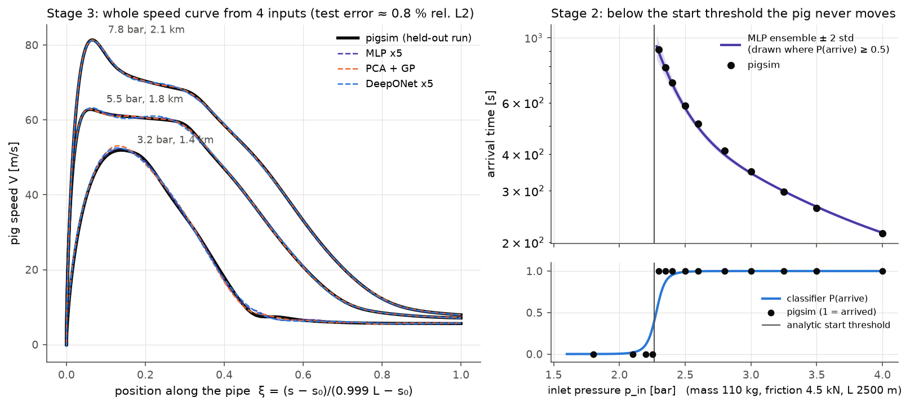

# pigsim-surrogate

[](https://github.com/NNOOHHDD/pigsim-surrogate/actions/workflows/tests.yml)
[](https://colab.research.google.com/github/NNOOHHDD/pigsim-surrogate/blob/main/notebooks/demo.ipynb)
[](LICENSE)


**A transient pipeline-pig solver re-implemented from a published paper, and
machine-learning surrogates for it compared against simple baselines: scalar
outputs, regime changes, inverse design, whole speed curves, anomaly
detection, valve control with reinforcement learning, and an MCP server.**



*Left: pig speed along the pipe for three held-out runs; pigsim (black) and three
curve models trained on 532 runs. Right: across the start threshold the pig
either never moves or arrives; the surrogate regressor is only drawn where the
arrival classifier says the pig arrives (`python docs/make_overview.py`).*

## The solver and how it was checked

`pigsim/` re-implements the model of Nieckele, Braga & Azevedo,
*Transient Pig Motion Through Non-Isothermal Gas and Liquid Pipelines*
(IPC2000-175): mass, momentum and energy equations on a moving, staggered,
implicitly coupled grid on each side of the pig, a pig force balance with
by-pass flow and stick/slip friction, and ideal-gas / liquid properties.
Details and every deliberate deviation from the paper are in
[docs/solver_ko.md](docs/solver_ko.md) (Korean).

| Check | Result |
|---|---|
| Analytic solutions (`python tests/test_pigsim.py`) | hydrostatic pressure 0.03 %, Darcy–Weisbach drop 0.01 %, isothermal compressible line 0.00 %, by-pass round trip and stick/slip logic exact |
| Paper case 1, riser dewatering (N₂ / water) | pig passing 350 / 650 / 850 m: −6 % / −1 % / +2 % against the paper's times |
| Paper case 2, gas line with area changes | 10 km / 15 km / 20 km / pipe exit: +6 % / −5 % / **+16 %** / +3 %; the stop at the 20 km contraction is reproduced, but it is reached 98 s later than in the paper |
| Speed and pressure curves read off the paper's figures | 8–12 % RMS ([verification/one_pig_sensitivity.md](verification/one_pig_sensitivity.md), which also covers grid / time-step sensitivity) |

So arrival times agree with the paper to about **±6 % at six of the seven
milestones** the paper gives; the arrival at the 20 km contraction is 16 % late.
Every surrogate below imitates pigsim, so this is also a floor on how well any
of them can describe the real physics.

## Results by stage

All surrogates use one made-up horizontal gas line (D = 0.30 m, nitrogen,
outlet valve into 1.5 bar) with four inputs: inlet pressure `p_in`, pig mass,
pig friction `F_fric` and length `L` ([surrogate/pipeline.py](surrogate/pipeline.py)).
Data sizes were set by timing a pilot and fitting a ~40 min, 4-core budget.

| Stage | Task (data) | Best | Numbers (held-out test set) | Details |
|---|---|---|---|---|
| 1 | `t_arrive`, `v_max` from 4 inputs (650 runs) | MLP ensemble ×5 | mean error 0.21 % / 0.24 %; inside ±2 std: 91 % / 66 % | [RESULTS.md §1–7](surrogate/RESULTS.md) |
| 2a | same split, classical baselines | **Gaussian process** | GP 0.018 % / 0.21 %; cubic polynomial (log inputs) 0.26 % / 0.28 %, i.e. as good as the MLP | [§8](surrogate/RESULTS.md) |
| 2b | wider inputs where the pig may never start (540 more runs) | **analytic start rule** | arrival yes/no: analytic rule 100 %, PyTorch classifier 97.5 %, regressors alone 74–96 %; near the threshold GP 1 %, MLP 3 %, cubic 6–11 % error | [§9](surrogate/RESULTS.md) |
| 2c | inverse design: lowest `p_in` meeting a time / speed target | ensemble + classifier + std penalty | re-run in pigsim: 5/5 candidates met the target far from the threshold, 4/5 near it (one 0.5 % over the speed cap); without the classifier 3/5 never started | [§10](surrogate/RESULTS.md) |
| 3 | whole speed curve V(ξ), 128 points (760 runs) | MLP ×5 ≈ PCA + GP | relative L2 error: MLP 0.75 %, PCA + GP 0.80 %, DeepONet 1.15 %, PCA + cubic 3.1 %, nearest neighbour 7.2 %; GP's ±2 std covers 92 %, ensembles 70–75 % | [RESULTS_stage3.md](surrogate/stage3/RESULTS_stage3.md) |
| Anomaly | 6 pressure / flow sensors, 5 fault kinds (641 runs) | 1D-CNN autoencoder on operating-point-normalised residuals | ROC-AUC: valve closing 1.00, supply drop 0.94, friction increase 0.86, sensor spikes 0.72, **sensor drift 0.57 (not detected)** | [RESULTS_anomaly.md](anomaly/RESULTS_anomaly.md) |
| Control | outlet-valve opening every 1 s: speed ≤ 8 m/s on the second half, arrive within 150 s; pig mass and friction unknown | **PI** (in pigsim) | lumped model, 200 pigs — violations / late: fixed 50 % / 84 %, PI 13.5 % / 12 %, PPO 7 % / 0 %. Same controllers in pigsim, 20 pigs: fixed 25 % / 85 %, **PI 0 % / 40 %, PPO 100 % / 0 %** (sim-to-sim gap) | [RESULTS_control.md](control/RESULTS_control.md) |
| MCP | 4 tools over stdio for LLM clients | — | scripted demo client (no LLM in the loop): "lowest `p_in` for 2 km within 300 s" — first answer missed by 0.02 s in pigsim, the script's 3-std retry met it | [README_mcp.md](README_mcp.md) |

### Where a polynomial was enough, and where it was not

- **Scalar outputs inside the trained box: enough.** A cubic polynomial in log
  inputs (70 coefficients, fitted in under a millisecond) matched the neural
  ensemble, and a Gaussian process beat both by 10× on arrival time (the GP
  and the polynomials used log inputs, the MLP raw inputs).
- **A wider box with a regime change: not enough.** One global polynomial has
  to bend around the start threshold and loses accuracy everywhere (in-box
  error 0.26 → 1.7 %). But the fix was not a neural network: the GP stayed
  most accurate, and whether the pig arrives at all was decided best by the
  analytic rule `p_in > 1.5 bar + 1.2 F_fric / A`, not by the classifier.
- **Whole curves: a nonlinear regressor was needed, not necessarily a network.**
  The curves need 20 principal components; a cubic polynomial on them stalls
  at 3 %, while an MLP and a GP on the same components reach 0.75–0.8 %.
  DeepONet was not the best here (fixed 128-point grid; 4 of its 5 members
  stopped at the epoch limit).
- **Anomaly detection: depends on the fault.** PCA on normalised residuals
  already catches a closing valve (AUC 1.00); the CNN autoencoder is clearly
  better for friction increase (0.86 vs 0.72). Nothing tried here detects a
  slow sensor drift, because the "expected normal signal" itself is off by
  ~0.4 bar.
- **Valve control: a PI was enough; reinforcement learning did not transfer.**
  PPO beat a tuned PI on the fast lumped model it was trained on (no late
  arrivals, small speed overshoots), but on pigsim it broke the speed limit in
  all 20 runs, right where the lumped model is least accurate. The PI regulates
  the measured speed and kept it under the limit in pigsim too. A PPO trained
  with a 0.5 m/s margin on a randomised model still failed in 18 of 20.

## Quickstart

```bash
git clone https://github.com/NNOOHHDD/pigsim-surrogate && cd pigsim-surrogate
pip install torch==2.14.0 --index-url https://download.pytorch.org/whl/cpu   # CPU wheel, optional
pip install -r requirements.txt
python tests/test_pigsim.py && python -m pytest -m "not slow"                  # ~1 min
python docs/make_overview.py                                                  # figure above, from saved models
```

Predict with the saved models (no simulation needed):

```python
from surrogate import registry
registry.predict([[5.5e5, 110, 3500, 1750]])        # p_in [Pa], mass [kg], F_fric [N], L [m]
mean, std = registry.deeponet().predict([[5.5e5, 110, 3500, 1750]])   # speed curve, 128 points
```

[notebooks/demo.ipynb](notebooks/demo.ipynb) shows prediction, inverse design and
curve prediction against a fresh pigsim run.

Full reproduction, stage by stage (4 cores):

| Command | Time |
|---|---|
| `python cases/case1_riser.py --t-end 1400 && python cases/case2_area_change.py --t-end 1700 && python plots/validation_table.py` | minutes |
| `python surrogate/generate_data.py && python surrogate/train_surrogate.py` | 28 min + 1 min |
| `python surrogate/baselines.py` | 30 s |
| `python surrogate/generate_wide_data.py && python surrogate/regime.py` | 20 min + 3 min |
| `python surrogate/inverse_design.py` | 1.5 min |
| `python surrogate/stage3/generate_curves.py && python surrogate/stage3/run_stage3.py` | 31 min + 11 min |
| `python anomaly/simulate.py && python anomaly/detect.py` | 27 min + 1 min |
| `python control/calibrate_lumped.py && python control/tune_baselines.py && python control/train_ppo.py && python control/train_ppo.py --robust && python control/evaluate.py` | 1 + 3.5 + 7 + 7 + 6 min |
| `python mcp_server/demo_client.py` | 1–2 min |

The generated datasets are small (≤ 1.6 MB) and committed, so every analysis
step can also be re-run without the simulations.

## Repository layout

```
pigsim/              the solver (fluids, geometry, pig force balance, moving-grid domains, coupling)
cases/               the two paper cases
plots/               paper comparison figures and tables
tests/               analytic checks (test_pigsim.py) and pytest suites
verification/        figure re-reading and numerical sensitivity of the paper cases
surrogate/           stage 1-2: data, MLP ensemble, baselines, regime transition, inverse design
  registry.py          the one place that loads trained models
  stage3/              speed-curve models (DeepONet and baselines)
anomaly/             sensor time series and anomaly detectors
control/             outlet-valve control: lumped model, gymnasium env, fixed / PI / PPO, pigsim check
mcp_server/          MCP server (stdio) and demo client
notebooks/           demo.ipynb
docs/                overview figure, detailed solver notes (Korean)
```

## Limits

- One generic test pipeline; the surrogates are only valid inside its four
  input ranges and know nothing about other geometries, valves or fluids.
- Everything is learnt from pigsim, which itself agrees with the paper's arrival
  times to about ±6 % at six of seven milestones (16 % at the seventh);
  real-world model error is not included.
- Ensemble standard deviations are over-confident (66–91 % of test points inside
  ±2 std instead of 95 %); near the start threshold they understate the error by
  up to ~9×. The PCA + GP curve model is the exception (92 %).
- The anomaly faults and sensor noise are simulated with simple assumptions;
  sensor drift is not detected by any method here.
- The control demo has one line and one start-up (empty line), and the pigsim
  check uses 20 + 10 runs; the outlet valve cannot limit the launch surge
  there, so the speed limit only applies to the second half of the line.
- Results come from single splits and seeds; small test sets (16–114 runs in
  some bins) make the smaller differences between models uncertain.

## Citation

If you use this code, please cite the paper whose model it re-implements
(machine-readable: [CITATION.cff](CITATION.cff)):

> A. O. Nieckele, A. M. B. Braga, L. F. A. Azevedo, "Transient Pig Motion Through
> Non-Isothermal Gas and Liquid Pipelines", *Proceedings of the 3rd International
> Pipeline Conference (IPC2000)*, Calgary, ASME, Paper No. IPC2000-175, 2000.

```bibtex
@inproceedings{nieckele2000transient,
  author    = {Nieckele, A. O. and Braga, A. M. B. and Azevedo, L. F. A.},
  title     = {Transient Pig Motion Through Non-Isothermal Gas and Liquid Pipelines},
  booktitle = {Proceedings of the 3rd International Pipeline Conference (IPC2000)},
  publisher = {ASME},
  number    = {IPC2000-175},
  year      = {2000}
}
```

The paper itself is not included. `plots/paper_reference.py` holds values read
off its figures for comparison.

## Authorship and tools

The code and documents in this repository were written with an AI coding
assistant (Claude Code) under my direction. I reviewed the results against the
solver's analytic checks and the published paper before publishing.

## License

[MIT](LICENSE) © 2026 NNOOHHDD
