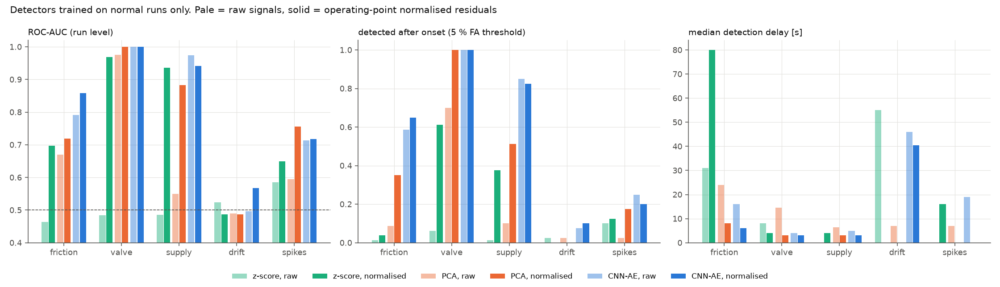
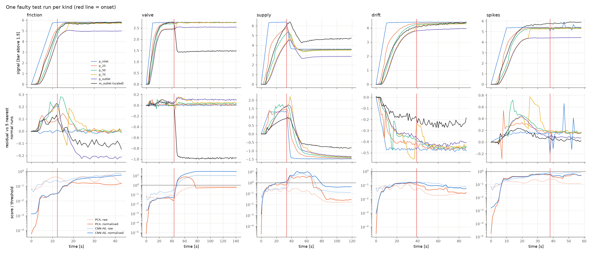

# 이상 탐지 — pig 운전 중 센서 시계열

pigsim으로 정상 운전과 고장 운전의 센서 시계열을 만들고, **정상 데이터만으로 학습한** 탐지기 3종을 비교했다. 결과는 있는 그대로 적었다. 센서 드리프트는 어느 탐지기도 잡지 못했다.

| 재현 명령 | 소요 |
|---|---|
| `python anomaly/simulate.py` → `runs.npz` (641회) | 파일럿 후 27분 (4 프로세스) |
| `python anomaly/detect.py` → `metrics.json`, `figures/` | 1분 |
| `python -m pytest tests/test_pipeline_hooks.py` → 연결부가 기존 결과를 바꾸지 않음 | 50초 |

## 1. 해석기 연결부

고장을 pigsim 물리로 만들기 위해 `surrogate/pipeline.build()`에 **선택 인자 3개**만 추가했다. `pigsim/`의 해석기 코드와 수치는 그대로다.

| 인자 | 용도 |
|---|---|
| `p_in_of_t(t, p_nominal)` | 입구(공급) 압력을 시간에 따라 바꿈 |
| `chi_of_t(t)` | 출구 밸브 개도를 시간에 따라 바꿈 |
| `F_fric_of_s(s)` | pig 마찰력을 위치에 따라 바꿈 (정지마찰 = 1.2 × 동마찰 유지) |

`tests/test_pipeline_hooks.py`(4개 모두 통과):
1. 인자를 주지 않으면 `surrogate/data.csv`의 1단계 결과 2건을 `t_arrive`, `v_max` 상대오차 1e-9 이내로 재현한다.
2. 명목값을 그대로 돌려주는 함수를 넣으면 이력(t, s, V, p1, p2)이 비트 단위로 같다.
3. 밸브를 닫는 함수를 넣으면 도착이 늦어진다(연결이 실제로 작동함).

해석기는 이미 고정 위치 기록 기능(`set_stations`)이 있어서 따로 추가하지 않았다.

## 2. 데이터

**신호 6개** (1 s 간격으로 다시 샘플링): 입구 압력(s = 0.5 m), 배관 25 / 50 / 75 % 위치 압력, 출구 압력(s = L − 0.5 m), 출구 질량유량. 측정 잡음을 모든 실행에 더했다(압력 0.002 bar + 측정값의 0.1 %, 유량 0.002 kg/s + 0.5 %).

| 종류 | 개수 | 만드는 방법 (pigsim 물리) | 시작 시각 |
|---|---|---|---|
| 정상 | 321 | LHS, 1단계 입력 범위 | — |
| 마찰 증가 | 80 | s_a = 0.3–0.7 L 이후 마찰 × 1.5–2.5 (5 m에 걸쳐) | pig가 s_a에 도달한 시각 |
| 출구 밸브 부분 닫힘 | 80 | 5 s 동안 개도 1 → 0.3–0.6 | t_a |
| 공급 압력 저하 | 80 | 5 s 동안 (p_in − 1.5 bar)를 50–80 %로 | t_a |
| 센서 드리프트 | 40 | 정상 실행 + 후처리: 채널 하나에 60 s당 0.05–0.15 bar(유량은 5–15 %)씩 커지는 오프셋 | t_a |
| 센서 스파이크 | 40 | 정상 실행 + 후처리: 채널 하나에 0.2–0.5 bar(유량은 20–50 %) 단발 스파이크 5개 | 첫 스파이크 |

- t_a = 1단계 대리모델이 예측한 도착 시간 × 0.3–0.6. 실행은 도착하거나 t_end = 2 × 예측 도착 + 60 s에서 끝난다.
- **샘플 수**: 파일럿 10회에서 실행당 12.7 s를 쟀고, 40분 × 85 %에 맞춰 원래 계획(800회)의 80 %인 641회로 줄였다.
- 마찰 증가 80건 중 2건은 pig가 멈춰 도착하지 못했다. 나머지는 모두 도착했다.
- 정상 실행 분할: 학습 192 / 검증 48 / 테스트 81. 고장 실행은 모두 테스트에 쓴다.

## 3. 탐지기와 두 가지 입력

| 입력 | 내용 |
|---|---|
| 원신호 (raw) | 압력은 1.5 bar 초과분(bar), 유량은 kg/s. 채널별 z-score |
| 운전 조건 정규화 (normalised) | 잔차 = 신호 − **같은 운전 조건의 예상 정상 신호**. 예상 신호는 log 입력 공간에서 가장 가까운 정상 학습 실행 5개를 같은 시각에서 거리 역수 가중 평균한 것이다. 학습 실행은 자기 자신을 빼고 계산했다. 그다음 채널별 z-score |

| 탐지기 | 시각 t의 점수 |
|---|---|
| z-score | 채널 중 \|z(t)\|의 최댓값 |
| PCA | 최근 32 s 창(6 × 32 값)의 PCA 재구성 오차. 정상 학습 창 분산의 99 % 유지 |
| CNN-AE | 같은 32 s 창의 1D 합성곱 오토인코더 재구성 오차 (PyTorch, 잠재 차원 16) |

- **임계값**: 정상 검증 실행 48개에서 실행별 최대 점수의 95 백분위. 즉 정상 실행의 약 5 %에서 경보가 울리도록 맞췄다.
- **ROC-AUC**: 실행별 최대 점수로, 정상 테스트 81건 대 해당 종류의 고장 실행.
- **탐지율과 지연**: 시작 시각 이후 첫 경보까지의 시간. 시작 전 경보는 따로 셌다.

## 4. 결과

### 4.1 ROC-AUC (실행 단위)

| 입력 / 탐지기 | 마찰 증가 | 밸브 닫힘 | 공급 저하 | 드리프트 | 스파이크 |
|---|---|---|---|---|---|
| 원신호 / z-score | 0.46 | 0.48 | 0.49 | 0.52 | 0.59 |
| 원신호 / PCA | 0.67 | 0.98 | 0.55 | 0.49 | 0.60 |
| 원신호 / CNN-AE | 0.79 | **1.00** | **0.97** | 0.50 | 0.71 |
| 정규화 / z-score | 0.70 | 0.97 | 0.94 | 0.49 | 0.65 |
| 정규화 / PCA | 0.72 | **1.00** | 0.88 | 0.49 | **0.76** |
| 정규화 / CNN-AE | **0.86** | **1.00** | 0.94 | **0.57** | 0.72 |

### 4.2 5 % 경보율 임계값에서 탐지율 / 지연 중앙값

| 입력 / 탐지기 | 정상 테스트 오경보율 | 마찰 증가 | 밸브 닫힘 | 공급 저하 | 드리프트 | 스파이크 |
|---|---|---|---|---|---|---|
| 원신호 / z-score | 4 % | 1 % / 31 s | 6 % / 8 s | 1 % / 0 s | 3 % / 55 s | 10 % / 0 s |
| 원신호 / PCA | 1 % | 9 % / 24 s | 70 % / 15 s | 10 % / 7 s | 3 % / 7 s | 3 % / 7 s |
| 원신호 / CNN-AE | 7 % | 59 % / 16 s | **100 % / 4 s** | **85 % / 5 s** | 7 % / 46 s | **25 %** / 19 s |
| 정규화 / z-score | 4 % | 4 % / 80 s | 61 % / 4 s | 38 % / 4 s | 0 % | 12 % / 16 s |
| 정규화 / PCA | 4 % | 35 % / 8 s | **100 % / 3 s** | 51 % / 3 s | 0 % | 18 % / 0 s |
| 정규화 / CNN-AE | 11 % | **65 % / 6 s** | **100 % / 3 s** | 82 % / 3 s | **10 %** / 41 s | 20 % / 0 s |

시작 전 경보 비율은 고장 종류별로 0–7 %다(`metrics.json`의 `alarm_before_onset`). 오경보율은 검증 48건으로 맞춘 임계값을 테스트 81건에 적용한 결과라 1–11 %로 흔들린다.

### 4.3 해석

- **밸브 닫힘은 쉽다.** 출구 유량이 바로 크게 줄어서, 정규화 PCA와 두 CNN-AE가 100 % 잡고 지연은 3–4 s다.
- **공급 압력 저하는 원신호 CNN-AE가 가장 좋았다**(AUC 0.97, 85 %, 5 s). 모든 압력이 함께 떨어지는 모양이라 원신호의 창 모양만으로도 드러난다. 정규화한 경우와 비슷하다.
- **마찰 증가는 운전 조건 정규화가 도움이 됐다.** CNN-AE 기준 AUC 0.79 → 0.86, 탐지율 59 → 65 %, 지연 16 → 6 s다. PCA는 0.67 → 0.72, z-score는 0.46 → 0.70이다. 마찰 증가는 하류 압력과 유량이 조금 줄어드는 정도라, "이 운전 조건에서 원래 어때야 하는가"를 알아야 보인다.
- **원신호 z-score는 쓸모가 없다**(AUC 0.46–0.59). 실행마다 압력 수준(입구 압력 3–8 bar)이 달라서, 고장보다 운전 조건의 차이가 훨씬 크다.
- **센서 드리프트는 어느 탐지기도 잡지 못했다**(AUC 0.49–0.57, 탐지율 ≤ 10 %). 원인을 확인했다. 정규화 잔차의 표준편차가 채널별 약 0.4 bar(99 백분위 0.9–1.6 bar)다. pig가 각 센서를 지나는 시각이 이웃 실행과 조금씩 달라 생기는 오차가 대부분이다. 그런데 실행이 짧아(시작 후 26–100 s) 드리프트는 끝날 때까지 0.04–0.25 bar밖에 자라지 못한다. 예상 신호의 오차보다 작은 신호는 정규화로도 드러나지 않는다.
- **스파이크도 약하다**(최고 AUC 0.76, 탐지율 ≤ 25 %). 32 s 창의 재구성 오차는 1초짜리 스파이크 하나를 평균 안에 묻는다. 1차 차분(급변) 기반 점수 같은 전용 특성이 필요하다.

## 5. 그림 (`anomaly/figures/`)

`detection_summary.png` — 고장 종류별 ROC-AUC, 5 % 경보율 임계값에서의 탐지율, 지연 중앙값. 옅은 색이 원신호, 진한 색이 정규화 입력이다.

`examples.png` — 종류별 고장 테스트 실행 하나씩. 위: 신호. 가운데: 정규화 잔차. 아래: PCA / CNN-AE 점수를 임계값으로 나눈 값(1을 넘으면 경보). 빨간 선이 고장 시작 시각이다. 드리프트 예에서는 시작 전부터 잔차가 −0.45 bar 정도 어긋나 있고, 드리프트는 그보다 작다.

## 6. 남은 문제

- **예상 정상 신호가 거칠다.** 5개 이웃의 평균은 pig가 센서를 지나는 시각 차이를 반영하지 못한다. 대리모델(예: 3단계 곡선 모델)로 운전 조건별 신호를 예측하거나, pig 위치를 기준으로 시간을 맞추면 잔차 잡음이 줄어 드리프트와 마찰 증가를 더 잘 잡을 수 있을 것이다.
- 스파이크와 드리프트처럼 센서 하나에만 생기는 고장은 채널 사이의 일관성(같은 물리로 묶인 이웃 센서와의 차이)을 쓰는 탐지기가 더 맞다.
- 정상 검증 실행이 48개라 5 % 임계값 자체가 흔들린다(테스트 오경보율 1–11 %).
- 모든 데이터는 pigsim이 만든 것이다. 실제 센서의 잡음, 지연, 샘플링은 단순한 가정으로만 넣었다.
