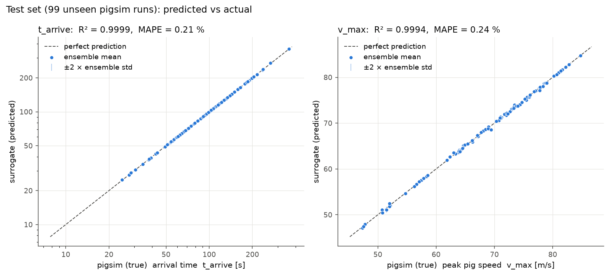
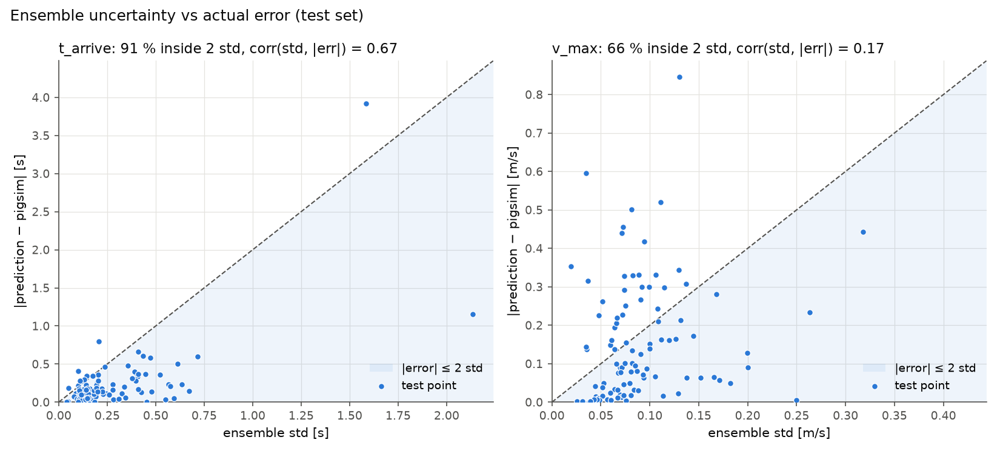
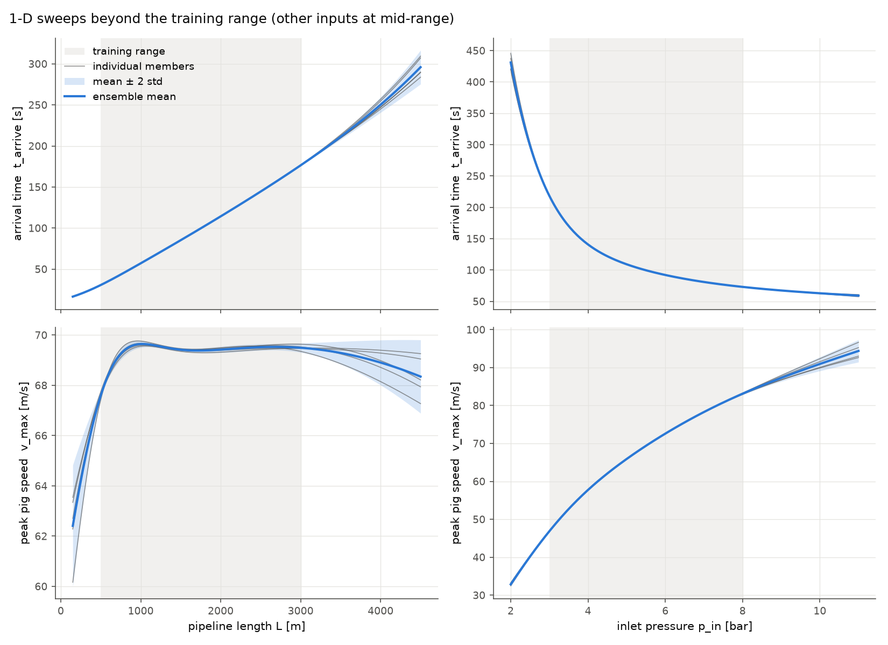
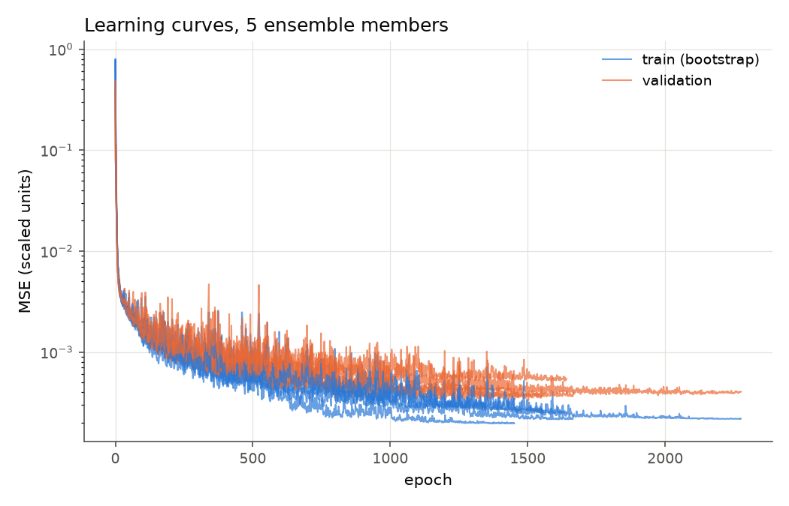

# surrogate/ — pigsim 대리모델 1단계

pigsim 한 번 실행에는 약 10초가 걸린다. 설계 최적화나 불확실성 전파처럼
수천~수만 번 호출해야 하는 작업에는 너무 느리다. 그래서 pigsim을 수백 번 돌려
**입력 → 출력 관계를 신경망(MLP)이 흉내 내도록** 학습시켰다. 학습된 대리모델은
예측 1건에 약 0.24 ms가 걸려 **약 4만 배** 빠르다 (한 점씩 호출 기준, 한꺼번에 넣으면 점당 약 370만 배).

> `pigsim/`, `cases/`(논문 재현 코드)는 전혀 수정하지 않았다. 여기 있는 코드는
> pigsim을 라이브러리로 가져다 쓸 뿐이다.

```
surrogate/
  pipeline.py          가상 배관 정의 + simulate(): pigsim 1회 실행 → 출력 2개
  generate_data.py     실행시간 측정 → 샘플 수 결정 → LHS 샘플링 → data.csv
  train_surrogate.py   MLP 5개 앙상블 학습 → metrics.json, figures/, models/
  data.csv             pigsim 650회 실행 결과 (입력 4 + 출력 2 + 기록용 열)
  checks.py            사후 점검: 범위 밖 비교, v_max 라벨 잡음, 입력 민감도
  metrics.json         테스트 성능, 학습/예측 시간
  RESULTS.md           결과 요약 (이 폴더만 보고 검토할 수 있게 정리)
  figures/             parity_test.png, uncertainty_vs_error.png,
                       sweep_extrapolation.png, learning_curves.png
  models/ensemble.pt   학습된 가중치 + 스케일링 통계

  # 2단계
  baselines.py         선형 / 다항 / GP vs MLP 앙상블 (같은 분할) → baselines.json
  generate_wide_data.py  입력 범위를 넓혀 pig 미출발·미도착 포함 → data_wide.csv (540회)
  regime.py            넓은 범위 회귀 + 도착 여부 분류기 → regime.json,
                       models/wide_ensemble.pt, models/arrival_classifier.pt
  inverse_design.py    대리모델 + 분류기로 역설계, 후보를 pigsim으로 재확인 → inverse*.json
```

실행 순서:

```bash
python tests/test_pigsim.py              # 0. 솔버 환경 확인 (전부 PASS)
python surrogate/generate_data.py        # 1. 약 28분 (4코어)
python surrogate/train_surrogate.py      # 2. 약 1분
# 2단계
python surrogate/baselines.py            # 3. 기준선 비교, 약 30초
python surrogate/generate_wide_data.py   # 4. 540회, 약 20분 (4코어)
python surrogate/regime.py               # 5. 영역 전환 비교, 약 3분
python surrogate/inverse_design.py       # 6. 역설계 + pigsim 재확인 (문제 A), 약 1.5분
python surrogate/inverse_design.py --t-max 1500 --v-max 15 --tag _slow   # 문제 B
```

2단계 결과는 `RESULTS.md` 8–11절에 있다. scikit-learn(GP, 다항 회귀)이 추가로 필요하다.

필요 패키지: `numpy scipy matplotlib pandas torch scikit-learn`. torch는 CPU로 충분하다
(`pip install torch --index-url https://download.pytorch.org/whl/cpu`가 가볍다.
그 주소가 막힌 환경이면 PyPI의 `pip install torch`도 CPU에서 그대로 동작한다).

---

## 0단계 — 환경 확인

`python tests/test_pigsim.py` → 정수압, Darcy–Weisbach, 등온 압축성 관유동,
bypass 식, stick/slip 5개 검증이 모두 해석해와 0.03 % 이내로 통과했다.
**대리모델은 원본 솔버보다 정확할 수 없으므로**, 데이터를 만들기 전에 솔버가
정상 동작하는지부터 확인한다.

## 1단계 — 가상 배관 정의 (`pipeline.py`)

특정 실제 설비가 아닌 일반적인 짧은 가스 배관이다.

| 고정 조건 | 값 |
|---|---|
| 배관 | 수평 강관, 내경 0.30 m, 두께 6.35 mm, 조도 0.046 mm |
| 유체 | 질소, 초기 1.5 bar · 20 °C 정지 상태 |
| 입구 | 10 s 동안 1.5 bar → `p_in` 선형 상승, 20 °C 가스 주입 |
| 출구 | 밸브 (C_d A)₀ = 0.002 m² → 1.5 bar 저장조 |
| pig | 밀봉형(bypass 없음), 정지마찰 = 1.2 × 동마찰 |

| 입력 (4개) | 범위 | 선택 이유 |
|---|---|---|
| `p_in` 입구 압력 | 3 – 8 bar abs | 최저값에서도 구동력(≈10.6 kN)이 최대 정지마찰(7.2 kN)보다 커서 pig가 항상 출발 |
| `mass` pig 질량 | 20 – 200 kg | 12인치급 pig의 현실적 범위 |
| `F_fric` 동마찰력 | 1 – 6 kN | 차압 0.14 – 0.85 bar에 해당 |
| `L` 배관 길이 | 500 – 3000 m | "짧은 배관" |

| 출력 (2개) | 정의 |
|---|---|
| `t_arrive` 도착 시간 | pig가 `s = 0.999 L`에 도달한 시각 (마지막 시간 스텝 안에서 선형 보간) |
| `v_max` 최고 속도 | 전 구간에서 pig 속도의 최댓값 |

**설계 중 확인한 것:**

- **출구 밸브 크기.** 처음 0.02 m²로 두니 순항 속도가 수십 m/s로 비현실적이었다.
  0.002 m²로 줄이자 순항 속도가 5–15 m/s(가스 pigging의 현실적 범위)가 되었다.
- **`v_max`는 발사 과도현상이다.** pig가 입구 옆에서 출발하면 상류 체적이 작아
  압력이 빠르게 걸리고, pig가 앞쪽의 압축성 가스(기체 스프링)로 튕겨 나간다.
  그래서 최고 속도는 출발 직후(t ≈ 5 s)에 나오며 밸브 크기와 거의 무관하다.
  논문 Case 2에서도 같은 현상으로 85 m/s가 나온다.
- **격자 수렴.** N = 20 / 40 / 80에서 두 출력이 0.05 % 이내로 같아 N = 40을 썼다.
  실행시간은 N보다 시간 스텝 수에 좌우된다.
- **에너지식 유지.** 등온 가정을 쓰면 `v_max`가 약 5 %, `t_arrive`가 약 2.5 %
  달라졌다. 대리모델 오차보다 큰 차이라서 비등온(전체 모델)을 유지했다.

## 2단계 — 데이터 생성 (`generate_data.py`)

**① 실행시간 먼저 측정 (pilot).** 본 실행과 같은 4-프로세스 풀에서 8회를 돌려
시간을 쟀다. 4개를 동시에 돌리면 1개일 때보다 느려지므로(메모리 대역폭 공유),
단독 실행이 아니라 **실제 조건에서 잰다**.

```
pilot: 8 runs on 4 workers in 23.5 s  (per run: mean 10.5 s, max 11.9 s)
budget 40 min x 80% safety, 11.8 s per run per worker -> n = 650
```

**② 샘플 수 결정.** 데이터 생성 예산을 40분으로 두고(pilot, 학습, 그림은 별도)
20 % 여유를 둔다.

    n = 0.8 × 40 min × 60 s × 4 workers ÷ (실행당 11.8 s) → 10 단위 내림 → 650

추정 32분, 실제 소요 27.6분 → 학습·그림까지 합쳐 전체 약 30분.

**③ 라틴 하이퍼큐브 샘플링(LHS).** 각 입력 범위를 n등분하고 각 구간에 정확히
점 하나씩 들어가게 뽑는다. 순수 무작위 샘플링은 우연히 한쪽에 몰리거나 빈 곳이
생기는데, LHS는 **적은 실행 수로 각 입력 축을 고르게 덮는다**.
`scipy.stats.qmc.LatinHypercube(seed=42)`로 재현 가능하게 했다.

**④ 병렬 실행 + 증분 저장.** `multiprocessing.Pool(4)`로 4코어를 모두 쓰고,
실행이 하나 끝날 때마다 CSV 한 줄을 바로 쓴다. 중간에 죽어도 그때까지의
결과가 남는다. 실패한 실행은 버리지 않고 `arrived = 0`으로 표시한다
(이번 데이터셋에서는 0건).

## 3단계 — MLP 앙상블 학습 (`train_surrogate.py`)

### PyTorch 기본 흐름 (처음 쓰는 사람용)

```python
model = nn.Sequential(nn.Linear(4, 64), nn.SiLU(),     # 층을 순서대로 쌓는다
                      nn.Linear(64, 64), nn.SiLU(),
                      nn.Linear(64, 2))
opt = torch.optim.Adam(model.parameters(), lr=3e-3)     # 가중치를 갱신할 방법
for epoch in ...:
    for xb, yb in minibatches:
        opt.zero_grad()                 # 1. 이전 스텝의 기울기 지우기 (안 지우면 누적됨)
        loss = MSELoss()(model(xb), yb) # 2. 순전파: 예측 → 손실
        loss.backward()                 # 3. 역전파: 모든 가중치에 대한 ∂loss/∂w 자동 계산
        opt.step()                      # 4. 기울기로 가중치 갱신
    model.eval(); with torch.no_grad(): # 검증: 기울기 계산 끄고 평가만
        val_loss = ...
```

- **텐서(`torch.tensor`)** 는 numpy 배열과 비슷하지만, 연산 기록을 남겨
  `backward()`로 미분을 자동 계산할 수 있다 (autograd).
- `nn.Linear(4, 64)` = `y = W x + b` (W: 64×4, b: 64개가 학습 대상).
- `model.train()` / `model.eval()`은 드롭아웃·배치정규화가 있을 때 동작을 바꾼다.
  이 모델엔 없지만 습관적으로 쓰는 게 좋다.

### 선택과 이유

| 선택 | 이유 |
|---|---|
| **데이터 분할 70 / 15 / 15** | train은 학습, val은 조기 종료 판단, **test는 마지막에 한 번만** 본다. test로 모델을 고르면 성능이 낙관적으로 부풀려진다. |
| **입력·출력 z-score 정규화, train 통계만 사용** | `p_in` ~ 10⁵ Pa, `mass` ~ 10² kg처럼 단위가 제각각이면 한 학습률로 모든 가중치를 맞출 수 없다. val/test 통계를 쓰면 정보 누수. |
| **`t_arrive`는 log로 학습** | 10 s ~ 수백 s로 범위가 넓고 대략 L / 속도에 비례(곱셈 구조) → log를 취하면 합 구조가 되어 학습이 쉬워지고, 오차가 상대오차 기준이 된다. |
| **작은 MLP 4 → 64 → 64 → 2 (약 4.6k 파라미터)** | 학습 데이터가 약 450개뿐이다. 큰 모델은 과적합. 출력 2개를 한 네트워크로 동시에 예측. |
| **SiLU 활성화** | ReLU와 달리 매끄러워서 대리모델이 어디서나 미분 가능 → 나중에 기울기 기반 최적화/민감도 분석에 쓸 수 있다. |
| **Adam, lr 3e-3, 미니배치 64, `ReduceLROnPlateau`** | Adam은 파라미터별 학습률을 자동 조정해 튜닝 부담이 적다. 정체되면 학습률을 절반으로. |
| **조기 종료(patience 300) + 최적 가중치 복원** | val 손실이 더 안 내려가면 멈추고, val이 가장 좋았던 시점의 가중치를 쓴다 → 과적합 방지. |
| **앙상블 5개: 서로 다른 초기값 + bootstrap** | 각 멤버는 다른 난수 초기값과, train에서 **복원추출**한 데이터로 학습한다. 데이터가 충분한 곳에선 5개가 같은 답을 내고, 부족한 곳(범위 밖, 경계)에선 답이 갈라진다. **멤버 간 표준편차 = 모델이 얼마나 모르는지(epistemic uncertainty)**. MC-dropout이나 베이지안 NN보다 구현이 단순하고 실무에서 잘 작동한다(Lakshminarayanan et al., 2017). |
| **std는 물리 단위로 계산** | 각 멤버 예측을 먼저 역변환(exp 포함)한 뒤 평균·표준편차를 구한다. |

## 결과

`metrics.json` — 테스트 세트 99개 (학습·조기 종료에 한 번도 쓰지 않은 pigsim 실행):

| 출력 | R² | RMSE | MAPE | 최대 오차 | 평균 앙상블 std | ±2 std 안에 든 비율 |
|---|---|---|---|---|---|---|
| `t_arrive` (22 – 417 s) | 0.99994 | 0.48 s | 0.21 % | 3.9 s | 0.28 s | 91 % |
| `v_max` (43 – 87 m/s) | 0.99943 | 0.22 m/s | 0.24 % | 0.85 m/s | 0.09 m/s | 66 % |

| 비용 | 값 |
|---|---|
| pigsim 1회 (4병렬 부하에서 평균) | 10.2 s |
| 대리모델 1회 호출 (점 1개) | 0.24 ms → **약 4만 배** |
| 대리모델 일괄 호출 (점 1만 개를 한 번에) | 점당 2.8 µs → 약 370만 배 |
| 앙상블 5개 학습 | 52 s (CPU 1스레드) |

속도비는 두 가지로 적었다. 최적화 루프처럼 한 점씩 부르면 Python/PyTorch 호출
오버헤드가 지배해 4만 배이고, Monte-Carlo처럼 한꺼번에 넣으면 370만 배다.
큰 숫자 하나만 말하면 과장이 된다.

### 그림

**`figures/parity_test.png` — 예측 vs 실제.** 점이 대각선 위에 있을수록 정확하다.
오차막대는 ±2 × 앙상블 std다. 대부분 점 크기보다 작아서 거의 보이지 않는다.
`t_arrive`는 log 축이다.



**`figures/uncertainty_vs_error.png` — 불확실성이 실제 오차를 따라가는가.**
x = 앙상블 std, y = 실제 |오차|. 음영(|오차| ≤ 2 std) 안에 들면 "불확실성이
오차를 제대로 덮었다"는 뜻이다.



- `t_arrive`: 91 %가 2 std 안에 들고 std와 오차의 상관계수가 0.67이다.
  std가 큰 점이 실제로 오차도 크다 → **불확실성이 쓸 만하다**.
- `v_max`: 66 %만 2 std 안에 들고 상관계수는 0.17이다 → **std가 오차를 과소평가한다**.
  원인 하나를 확인했다. 오차가 가장 큰 6개 점을 더 작은 시간 스텝
  (`cfl_pig` 0.02 → 0.005, `dt_max` 1 → 0.25 s)으로 다시 돌렸더니 pigsim의
  `v_max` 자체가 최대 0.75 m/s 달라졌다. 이는 대리모델의 최대 오차와 같은 크기다.
  발사 직후 짧은 속도 피크를 이산 시간 스텝으로 샘플링하기 때문에
  **정답 라벨에 약 1 % 수준의 수치 잡음이 있다**. 앙상블 std는 모델 불확실성만
  나타내므로 이 잡음은 잡지 못한다. 다만 6개 중 절반은 라벨이 거의 변하지 않았으므로,
  잡음이 전부를 설명하지는 않는다. 오차 자체는 0.24 %로 여전히 작다.

**`figures/sweep_extrapolation.png` — 학습 범위 밖으로 나가면.** 다른 입력은
중앙값으로 고정하고 L과 p_in을 학습 범위(회색) 밖까지 움직였다. 회색 선은 5개
멤버 각각이다.



- 범위 안에서는 5개 선이 겹치고, 범위 밖(L > 3000 m, L < 500 m)에서는 갈라져
  띠가 넓어진다. **앙상블 불확실성의 핵심: 데이터가 없는 곳에서 모델이 "모른다"고 말한다.**
- 하지만 std가 커졌다고 오차를 다 덮는 것은 아니다. `surrogate/checks.py`로 범위 밖
  4점을 pigsim과 직접 비교했다. L = 4500 m, p_in = 11 bar에서는 오차가 std의 0.3–1.5배라
  잘 덮였지만, **L = 250 m에서는 오차가 13–21 %로 std의 10–14배**였다. 또
  **p_in = 2 bar에서는 pig가 정지마찰을 못 이겨 아예 출발하지 않는데**
  (구동력 0.5 bar × 단면적 ≈ 3.5 kN < 정지마찰 4.2 kN), 대리모델은 "431 s에 도착,
  v_max 32.9 ± 0.3 m/s"라고 자신 있게 답한다. 학습 데이터에 없는 **물리 영역의 전환**
  (stick)은 5개 멤버가 모두 모르므로 함께 틀린다. 그림에서 p_in 곡선의 왼쪽 끝
  (약 2.1 bar 미만)은 이 영역이다. → 입력 범위 검사와 "출발 가능 여부" 판정을
  따로 두어야 한다.
- 물리적 경향도 맞다. `t_arrive`는 L에 거의 비례하고 p_in이 높을수록 짧아진다.
  `v_max`는 p_in과 함께 커지고, 짧은 배관에서는 하류 가스 체적이 작아
  "기체 스프링"이 단단해지므로 낮아진다.

**`figures/learning_curves.png`** — 5개 멤버의 train / validation 손실.
val이 평평해지면 조기 종료된다(1450–2280 epoch). train < val 간격이 작아
과적합이 심하지 않다.



### 학습된 모델 불러오기

```python
import numpy as np
from surrogate.train_surrogate import load_ensemble
ens = load_ensemble()                                  # models/ensemble.pt
mean, std, members = ens.predict(np.array([[5.5e5, 110.0, 3500.0, 1750.0]]))
# 입력 순서 p_in [Pa], mass [kg], F_fric [N], L [m] → mean/std: [t_arrive s, v_max m/s]
```

사후 점검(범위 밖 비교, `v_max` 라벨 잡음, 입력 민감도)은
`python surrogate/checks.py`(약 1.5분)로 재현한다. 결과 요약은 `RESULTS.md`.

---

## 한계와 다음 단계

- 앙상블 std는 **모델 불확실성만** 나타낸다. pigsim 자체가 결정론적이라 데이터
  잡음(aleatoric)은 없고, pigsim이 실제 물리와 다른 정도(모델 형식 오차)도 포함하지 않는다.
- 5개 멤버의 std는 보정(calibration)된 확률이 아니다. `v_max`는 2 std 안에 66 %만 든다
  (정규분포라면 95 %). validation 세트로 std 배율을 맞추는 사후 보정(recalibration)이나,
  잡음까지 예측하는 평균·분산 출력 네트워크(Gaussian NLL)가 다음 후보다.
- 다음 단계 후보: 불확실성이 큰 곳에 pigsim을 추가로 돌리는 **능동 학습**,
  입력 추가(밸브 크기, 온도, bypass), 출력 추가(최대 압력, 정지 여부 분류),
  pigsim 시계열 전체를 예측하는 모델.
