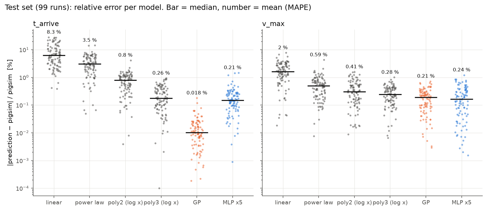
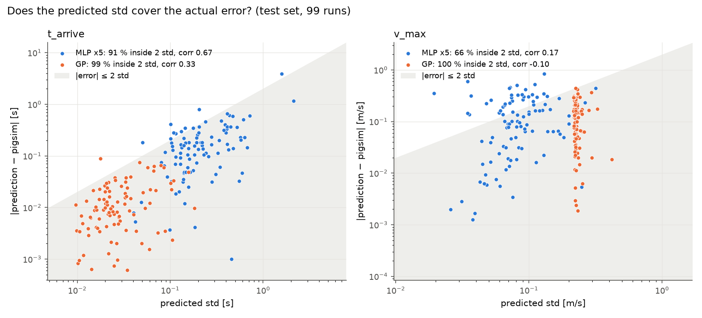
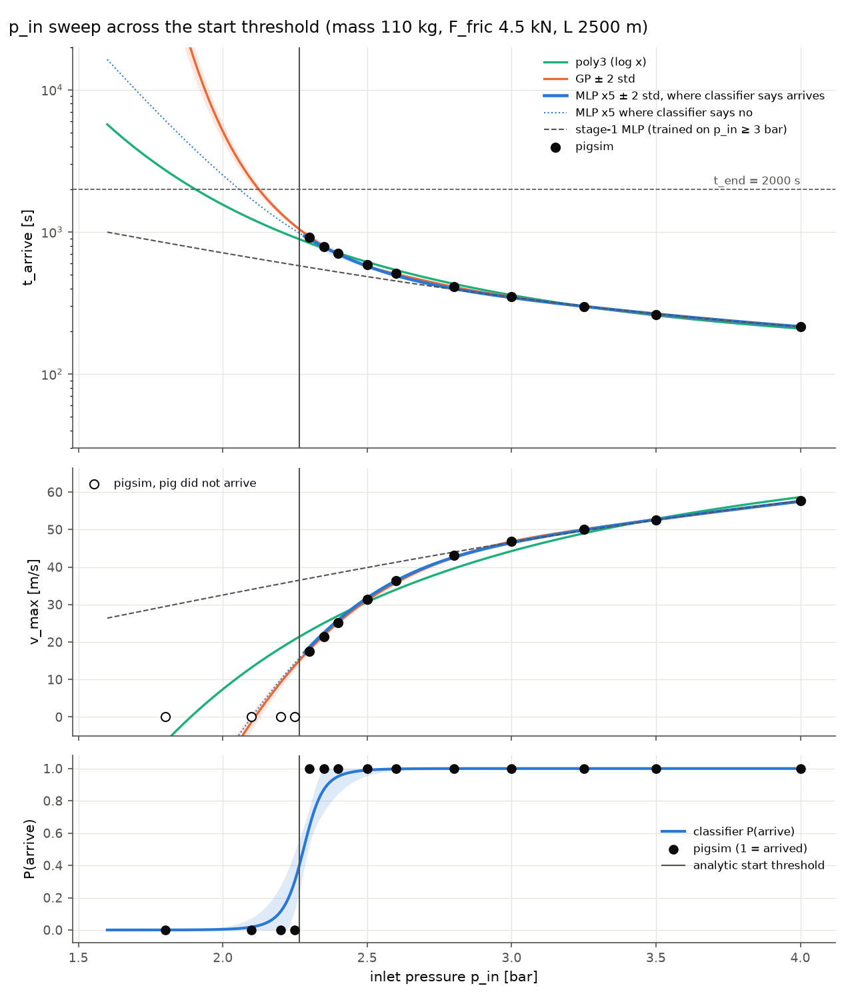
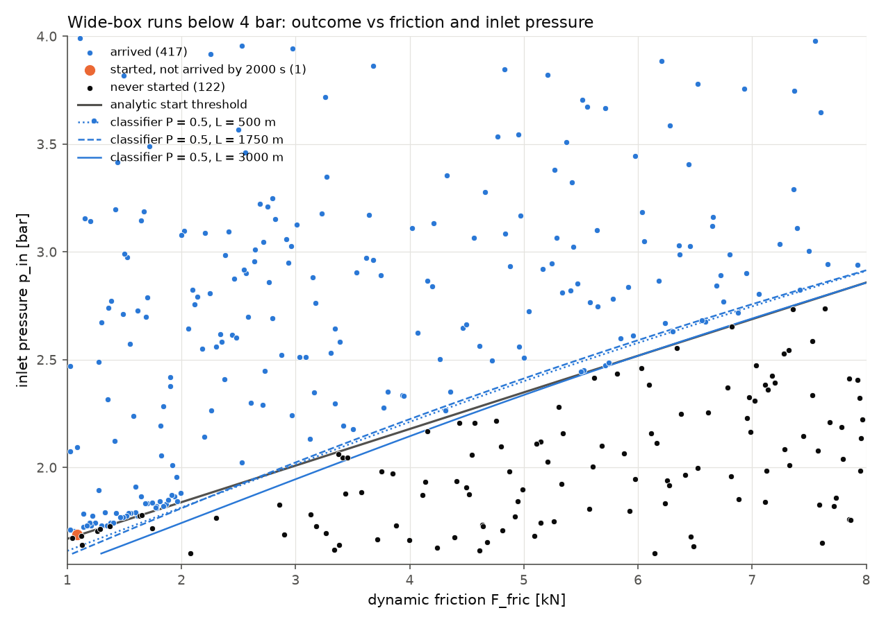
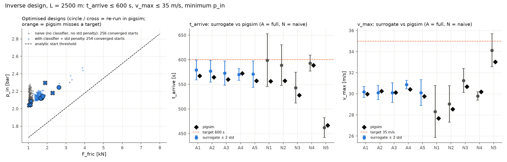
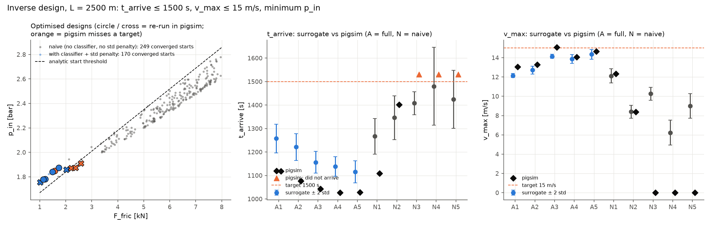

# pigsim 대리모델 — 결과 요약 (1단계: 1–7절, 2단계: 8–11절)

이 파일 하나만 보고 작업을 검토할 수 있도록 정리했다. 코드 설명은 `surrogate/README.md`에 있다.

- **원본 코드는 수정하지 않음**: `pigsim/`, `cases/`, `tests/`는 Nieckele et al.(2000) 논문 재현 코드 그대로다. pigsim은 라이브러리로 불러다 쓰기만 했다.
- **환경**: Python 3.11, numpy 2.4, scipy 1.17, pandas 3.0, torch 2.14(PyPI 빌드, CPU로 실행), scikit-learn 1.9(2단계), 4코어, GPU 없음.
- **솔버 사전 확인**: `python tests/test_pigsim.py`의 해석해 비교 5종이 모두 PASS했다(오차 ≤ 0.03 %).

| 재현 명령 | 소요 |
|---|---|
| `python surrogate/generate_data.py` → `data.csv` | 27.6분 (4 프로세스) |
| `python surrogate/train_surrogate.py` → `metrics.json`, `figures/`, `models/ensemble.pt` | 56 s |
| `python surrogate/checks.py` → 5절의 범위 밖 비교, 라벨 잡음, 민감도 | 1.5분 |
| **2단계** `python surrogate/baselines.py` → 8절 기준선 비교 | 25 s |
| `python surrogate/generate_wide_data.py` → `data_wide.csv` (540회) | 19.8분 (4 프로세스) |
| `python surrogate/regime.py` → 9절 영역 전환 | 약 3분 |
| `python surrogate/inverse_design.py` 및 `--t-max 1500 --v-max 15 --tag _slow` → 10절 역설계 | 각 약 1.5분 |

---

## 1. 문제 정의 — 가상 가스 배관

특정 실제 설비를 모델링한 것이 아닌 일반적인 예제다. 정의는 `surrogate/pipeline.py`에 있다.

```
입구(압력 상승) ──[pig]──────────────────── 출구 밸브 ── 1.5 bar 저장조
|<──────────────────────── L ──────────────────────>|
```

### 고정 조건

| 항목 | 값 |
|---|---|
| 배관 | 수평 직선 강관, 내경 0.30 m (단면적 0.0707 m²), 두께 6.35 mm, 조도 0.046 mm, E = 200 GPa, ν = 0.3 |
| 열전달 | U = 10 W/(m²K), 외기 20 °C |
| 유체 | 질소 이상기체 (pigsim `nitrogen()`), 초기 1.5 bar abs · 20 °C · 정지 상태 |
| 입구 경계 | 압력을 10 s 동안 1.5 bar → `p_in`으로 선형 상승, 그 뒤 일정. 유입 가스 20 °C |
| 출구 경계 | 밸브 (C_d A)₀ = 0.002 m² (단면적의 약 3 %), 개도 χ = 1, 1.5 bar 저장조로 배출 |
| pig | 밀봉형(bypass 없음). 정지마찰 = 1.2 × 동마찰. 출발 위치 s = 2 m, 초기 속도 0 |
| 수치 설정 | pig 양쪽 각 40셀, 비등온(에너지식 포함), 엔탈피 풍상차분(pigsim 기본값), dt₀ 0.02 s, dt_max 1 s, cfl_pig 0.02, t_end 2000 s |

### 입력 4개 (라틴 하이퍼큐브, 선형 스케일)

| 입력 | 범위 | 근거 |
|---|---|---|
| `p_in` 입구 압력 | 3 – 8 bar abs | 최저 3 bar에서도 구동력 (3 − 1.5) bar × 0.0707 m² ≈ 10.6 kN이 최대 정지마찰 7.2 kN보다 크다 → 모든 조합에서 pig가 출발 |
| `mass` pig 질량 | 20 – 200 kg | 12인치급 pig의 현실적 범위 |
| `F_fric` 동마찰력 | 1 – 6 kN | 차압 0.14 – 0.85 bar에 해당 |
| `L` 배관 길이 | 500 – 3000 m | 짧은 배관 |

### 출력 2개

| 출력 | 정의 | 데이터 범위 |
|---|---|---|
| `t_arrive` 도착 시간 | pig가 s = 0.999 L에 도달한 시각. 마지막 시간 스텝 안에서 선형 보간 | 22.7 – 417 s |
| `v_max` 최고 속도 | pig 속도 이력의 최댓값 | 43.0 – 86.9 m/s |

### 설계하면서 확인한 것

- **출구 밸브 크기**: 0.02 m²로 두면 순항 속도가 수십 m/s였다. 0.002 m²로 줄이자 순항 속도가 5 – 15 m/s가 되었다(3 km를 3 bar로 보낼 때 평균 약 6 m/s).
- **`v_max`의 정체**: 순항 속도가 아니라 **출발 직후의 과도현상**이다. pig가 입구 바로 옆에서 출발해 상류 체적이 작으므로, 하류의 압축성 가스(기체 스프링)를 향해 튕겨 나간다. 중앙값 조건에서 최고 속도는 t ≈ 5 s, s ≈ 150 m에서 나오며, 밸브 크기를 10배 바꿔도 거의 변하지 않는다. 논문 Case 2의 85 m/s 피크도 같은 현상이다.
- **격자 수렴**: 중앙값 조건에서 N = 20 / 40 / 80이면 `t_arrive` = 96.97 / 96.98 / 96.98 s, `v_max` = 72.69 / 72.72 / 72.73 m/s이다(등온 조건 비교). 그래서 N = 40을 썼다.
- **에너지식 유지**: 등온 근사로 바꾸면 `v_max`가 69.3 → 72.7 m/s(약 5 %), `t_arrive`가 99.4 → 97.0 s(약 2.5 %) 달라진다. 대리모델 오차(약 0.2 %)보다 훨씬 커서 비등온 전체 모델을 썼다.

## 2. 샘플 수, 실행 시간, 실패와 제외

| 항목 | 값 |
|---|---|
| pilot 측정 | 실제와 같은 4-프로세스 풀에서 8회 실행(별도 LHS, seed 1042, `data.csv`에는 미포함). 23.5 s 소요, 1회 평균 10.5 s, 최대 11.9 s |
| 샘플 수 결정 | 데이터 생성 예산을 40분으로 두고 20 % 여유를 둠. n = 0.8 × 2400 s × 4 ÷ 11.8 s → 10 단위로 내림 → **650** |
| 샘플링 | `scipy.stats.qmc.LatinHypercube(d=4, seed=42)` |
| pigsim 1회 실행 시간 (4병렬 부하, 650회) | 평균 **10.15 s**, 중앙값 10.23 s, 범위 7.1 – 15.2 s. 시간 스텝 547 – 862개 |
| 전체 소요 | 추정 32분 → 실제 **27.6분**. 학습과 그림까지 합쳐 약 30분 |
| **실패** | **0건**. 예외(발산)가 없었고 650건 모두 pig가 출구에 도착했다(`arrived = 1`) |
| **제외** | **0건**. 650개를 모두 사용했다 |

실패가 없었던 이유는 입력 범위 설계에 있다. pig가 출발하지 못하는 경계는 p_in < 1.5 bar + 1.2 F_fric / A = 1.67 – 2.52 bar인데, 학습 범위의 최저값 3 bar가 이보다 위에 있다. 코드는 실패에도 대비해 두었다. 예외가 나거나 pig가 t_end까지 도착하지 못하면 그 행을 `arrived = 0`, 출력 NaN으로 CSV에 남기고, 학습할 때 제외한다.

`data.csv` 열: `id, p_in [Pa], mass [kg], F_fric [N], L [m], t_arrive [s], v_max [m/s], arrived, n_steps, wall_s`.

## 3. 데이터 분할

- **방식**: `numpy.random.default_rng(0)`으로 무작위 순열을 만들어 **학습 70 % / 검증 15 % / 테스트 15 % = 454 / 97 / 99**로 나눴다. 층화 추출은 하지 않았지만, 원래 샘플이 LHS라서 테스트 점도 입력 공간에 고르게 퍼져 있다.
- **검증 세트**: 조기 종료와 최적 가중치 선택에만 쓴다.
- **테스트 세트**: 학습과 모델 선택에 한 번도 쓰지 않았고, 마지막 평가에서 한 번만 봤다.
- **정규화 통계**(평균, 표준편차): 학습 세트로만 계산했다. 검증·테스트 정보가 새지 않게 하기 위해서다.
- **앙상블 멤버별 학습 데이터**: 454개에서 복원추출(bootstrap)로 454개를 다시 뽑는다. 검증·테스트 세트는 5개 멤버 모두 같다.

## 4. 신경망, 학습 설정, 앙상블

| 항목 | 설정 |
|---|---|
| 입력 전처리 | 4개 입력 각각 z-score (학습 세트 통계) |
| 출력 전처리 | `t_arrive`는 자연로그를 취한 뒤 z-score, `v_max`는 바로 z-score |
| 구조 | `Linear(4,64) → SiLU → Linear(64,64) → SiLU → Linear(64,2)`, 파라미터 4,610개. 출력 2개를 한 네트워크로 동시 예측 |
| 손실 | MSE (정규화된 공간) |
| 옵티마이저 | Adam, lr 3e-3, weight_decay 1e-5, 미니배치 64 |
| 학습률 조정 | `ReduceLROnPlateau` (검증 손실 기준, factor 0.5, patience 100) |
| 종료 | 최대 3000 epoch. 검증 손실이 300 epoch 동안 개선되지 않으면 조기 종료하고 검증 최저 시점의 가중치를 복원 |
| 실제 학습 | 멤버별 1452 – 2276 epoch에서 종료, 최저 검증 MSE 3.3e-4 – 5.2e-4. 5개 합계 51.5 s (CPU 1스레드) |
| 앙상블 | 5개 멤버. 멤버마다 초기값 seed(0 – 4)와 bootstrap 표본이 다르다 |
| 예측과 불확실성 | 멤버별 예측을 먼저 물리 단위로 되돌리고(`t_arrive`는 exp까지), 그 뒤 5개의 평균을 예측값, 표준편차(ddof = 0)를 불확실성으로 쓴다 |
| 저장 | `models/ensemble.pt` (가중치 + 정규화 통계). 불러오기는 `train_surrogate.load_ensemble()` |

## 5. 결과

### 5.1 테스트 세트 정확도 (99건)

| 출력 | R² | 상대오차 중앙값 | 평균 (MAPE) | 95 백분위 | 최대 | RMSE | 최대 절대오차 |
|---|---|---|---|---|---|---|---|
| `t_arrive` | **0.99994** | 0.15 % | **0.21 %** | 0.52 % | 1.47 % | 0.48 s | 3.9 s |
| `v_max` | **0.99943** | 0.16 % | **0.24 %** | 0.72 % | 1.22 % | 0.22 m/s | 0.85 m/s |

검증 세트도 비슷하다: R² 0.99937 / 0.99952, MAPE 0.37 % / 0.26 %. 테스트 성능이 우연히 좋게 나온 것은 아니다.

### 5.2 앙상블 표준편차의 크기와 신뢰도 (테스트 세트)

| 출력 | 평균 std | 중앙값 | 최대 | 예측값 대비 평균 | 최대 | \|오차\| ≤ 1 std | ≤ 2 std | corr(std, \|오차\|) |
|---|---|---|---|---|---|---|---|---|
| `t_arrive` | 0.28 s | 0.18 s | 2.13 s | 0.25 % | 0.69 % | 70 % | **91 %** | 0.67 |
| `v_max` | 0.09 m/s | 0.08 m/s | 0.32 m/s | 0.14 % | 0.62 % | 45 % | **66 %** | 0.17 |

비교 기준: std가 보정된 정규분포 1σ라면 68 %가 1 std 안에, 95 %가 2 std 안에 들어야 한다.

- **`t_arrive`**: std가 오차와 같은 크기이고, std가 큰 점이 실제로 오차도 크다(상관 0.67). 조금 과소평가하지만 쓸 만하다.
- **`v_max`**: std가 실제 오차의 약 절반이고 오차와의 상관도 약하다(0.17). **과소평가**다. 원인 하나를 확인했다(5.3).

### 5.3 `v_max` 라벨 자체의 수치 잡음 (`checks.py` 2번)

데이터 650건 중 `v_max` 예측 오차가 가장 큰 6건을 시간 스텝을 4배 줄여(`cfl_pig` 0.02 → 0.005, `dt_max` 1 → 0.25 s) 다시 계산했다.

| id | 원래 dt | 작은 dt | 변화 | 대리모델 |
|---|---|---|---|---|
| 81 | 63.62 | 64.37 | **+0.76** | 64.39 |
| 94 | 45.63 | 46.01 | +0.39 | 47.06 |
| 348 | 57.53 | 57.90 | +0.37 | 56.70 |
| 646 | 54.73 | 54.65 | −0.08 | 53.83 |
| 568 | 69.42 | 69.44 | +0.02 | 68.57 |
| 606 | 60.44 | 60.39 | −0.05 | 59.67 |

- 짧은 속도 피크를 적응 시간 스텝으로 샘플링하므로, 정답 라벨 `v_max`에 **최대 약 0.8 m/s(약 1 %)의 수치 잡음**이 있다. 이는 대리모델의 최대 오차와 같은 크기다. id 81에서는 대리모델이 원래 라벨보다 작은 dt의 값에 더 가깝다.
- 앙상블 std는 **모델 불확실성(epistemic)만** 나타내므로 이 잡음은 잡지 못한다.
- 단, 6건 중 3건은 라벨이 거의 변하지 않았다. 잡음이 오차 전부를 설명하지는 않는다.

### 5.4 학습 범위 밖 (`checks.py` 1번, 나머지 입력은 범위 중앙값)

| 점 | 출력 | pigsim | 대리모델 | 상대오차 | std | \|오차\|/std |
|---|---|---|---|---|---|---|
| L = 4500 m | `t_arrive` | 280.1 s | 296.0 s | +5.7 % | 10.3 s | 1.5 |
| | `v_max` | 69.27 | 68.35 | −1.3 % | 0.73 | 1.3 |
| p_in = 11 bar | `t_arrive` | 58.9 s | 59.3 s | +0.6 % | 1.21 s | 0.3 |
| | `v_max` | 95.53 | 94.39 | −1.2 % | 1.48 | 0.8 |
| L = 250 m | `t_arrive` | 17.6 s | 20.0 s | **+13.4 %** | 0.23 s | **10.2** |
| | `v_max` | 53.06 | 64.19 | **+21.0 %** | 0.79 | **14.0** |
| p_in = 2 bar | — | **pig가 출발하지 못함** | 431 s 도착, v_max 32.9 m/s | — | 9.8 s / 0.30 | — |

범위 중앙에서 std는 0.06 s / 0.05 m/s이다. 범위 밖으로 나가면 std가 4 – 180배로 커진다. 즉 앙상블은 "범위 밖"이라는 신호를 준다. 하지만 그 크기는 믿을 수 없다.

- **L = 250 m**: 배관이 짧아지면 하류 기체 스프링이 단단해져 발사 과도현상이 달라진다. 이 비선형이 학습 범위 안에서는 보이지 않아, 대리모델이 오차를 10배 이상 과소평가한다.
- **p_in = 2 bar**: 구동력 3.5 kN이 정지마찰 4.2 kN보다 작아 **pig가 멈춘 채로 있다**. 대리모델은 이 영역 전환(stick)을 본 적이 없어서, 5개 멤버가 모두 매끄러운 곡선을 연장해 "도착한다"고 자신 있게 틀린다.

### 5.5 입력 민감도 (`checks.py` 3번, 대리모델 사용)

학습 범위 안의 무작위 기준점 2000개에서 입력 하나만 최저 → 최고로 바꿨을 때의 평균 출력 변화다(각 기준점의 예측값 대비 %).

| 입력 | `t_arrive` | `v_max` |
|---|---|---|
| `p_in` | −142 % | +55 % |
| `L` | +182 % | +3.7 % |
| `F_fric` | +18 % | −3.2 % |
| `mass` | **+0.6 %** | +15 % |

`t_arrive`는 L과 p_in이 지배하고, pig 질량의 영향은 거의 없다. `v_max`는 p_in과 질량이 지배하고, 마찰력과 L의 영향은 작다. 역설계를 논하는 7절의 근거로 쓴다.

### 5.6 계산 비용

| 항목 | 값 |
|---|---|
| pigsim 1회 | 10.15 s |
| 대리모델 1점 호출 (루프에서 한 점씩) | 0.24 ms → **약 4.2만 배** |
| 대리모델 일괄 호출 (1만 점을 한 번에) | 점당 2.8 µs → 약 365만 배 |
| 전체 비용 | 데이터 27.6분 + 학습 52 s |

## 6. 그림 (`surrogate/figures/`)

| 파일 | 보여주는 것 |
|---|---|
| `parity_test.png` | 테스트 99건의 **예측 vs 실제 산점도**. 왼쪽 `t_arrive`(log 축), 오른쪽 `v_max`. 점선은 완벽 예측, 세로 막대는 ±2 × 앙상블 std(대부분 점보다 작아 거의 안 보임). 제목에 R²와 MAPE 표시 |
| `uncertainty_vs_error.png` | x = 앙상블 std, y = 실제 \|오차\|. 음영(\|오차\| ≤ 2 std) 안에 드는 비율과 상관계수를 제목에 표시. `t_arrive`는 91 %·0.67로 쓸 만하고, `v_max`는 66 %·0.17로 과소평가됨이 보인다 |
| `sweep_extrapolation.png` | 다른 입력을 중앙값에 고정하고 L(150 – 4500 m)과 p_in(2 – 11 bar)을 학습 범위(회색) 밖까지 바꾼 1차원 곡선. 멤버 5개(회색 선), 평균(파란 선), ±2 std 띠. 범위 밖에서 멤버가 갈라지는 것이 보인다. **주의**: p_in 약 2.1 bar 미만은 실제로 pig가 출발하지 못하는 영역이므로 이 부분 곡선은 물리적으로 틀렸다(5.4) |
| `learning_curves.png` | 멤버 5개의 학습(bootstrap)·검증 MSE를 epoch별로 그린 것(log 축). 검증 손실이 평평해진 뒤 조기 종료되었고, 학습·검증 간격이 작다 → 과적합이 크지 않음 |

## 7. 한계와 다음 단계

### 한계

1. **대리모델은 pigsim을 흉내 낼 뿐이다.** pigsim과 실제 물리의 차이는 포함하지 않는다. 논문 재현 오차는 도착 시각 기준 약 ±6 %였고, 이는 대리모델 오차(0.2 %)보다 한 자릿수 이상 크다.
2. **적용 범위가 좁다.** 입력 4개의 범위 안에서만 유효하다. 밸브 크기, 배관 직경, 출발 위치, 온도, bypass, 경사는 모두 고정되어 있다.
3. **`v_max`는 출발 조건에 민감한 과도현상 값이다.** 출발 위치 s = 2 m와 입구 압력 상승 시간 10 s를 고정한 결과이며, 실제 발사 장치의 형상이 다르면 값이 달라진다.
4. **불확실성이 보정되지 않았다.** `v_max`는 2 std 안에 66 %만 든다. 라벨 잡음(aleatoric)은 모델에 없다.
5. **영역 전환을 모른다.** "pig 정지 또는 미도착" 같은 이산적 결과를 표현할 수 없고, 그런 영역에서 자신 있게 틀린다(5.4의 p_in = 2 bar).
6. **통계 기반이 작다.** 테스트 99건, 앙상블 5개라 std 추정 자체의 오차가 크다. 테스트 분할도 한 번뿐이다(교차검증 없음).

### 역설계(목표 출력 → 입력)로 가려면 필요한 것

역설계 예: "L = 2 km 배관에서 120 s 안에, 최고 속도 70 m/s 이하로 도착하려면 p_in은 얼마인가?", 또는 "측정된 도착 시간과 최고 속도로 마찰력과 질량을 추정하라."

1. **출발 가능 여부 판정(분류기) 또는 제약 조건**: 최적화기는 대리모델이 자신 있게 틀리는 곳(5.4의 정지 영역)을 찾아 들어가기 쉽다. 학습 범위를 넓혀 정지·미도착 샘플을 포함하고, "도착 여부" 분류기를 함께 학습시켜 제약으로 걸어야 한다. 해석적 하한 p_in > 1.5 bar + 1.2 F/A도 쓸 수 있다.
2. **탐색 범위를 학습 범위로 제한**: 입력 경계를 hard constraint로 둔다. 가능하면 앙상블 std에 벌점을 주어 불확실한 곳을 피한다.
3. **보정된 불확실성**: 검증 세트로 std 배율을 맞추는 사후 보정(recalibration)을 한다. 또는 평균과 분산을 함께 출력하는 네트워크(Gaussian NLL)로 라벨 잡음까지 모델링한다. 측정값으로 역추정하려면 측정 오차 모델도 필요하다.
4. **식별 가능성(identifiability) 점검**: 출력 2개로 입력 4개를 정할 수는 없다. 알려진 입력(보통 L, mass)은 고정하고 설계 변수만 푼다. 5.5를 보면 mass는 `t_arrive`에 거의 영향이 없어서 `v_max`로만 결정된다. 그런데 `v_max`의 라벨 잡음(약 1 %)이 mass 효과(범위 전체에서 15 %) 대비 무시할 수 없다. 해가 유일하지 않을 때는 점 하나가 아니라 해 집합이나 사후분포(MCMC, 앙상블 기반 베이지안 역추정)로 답해야 한다.
5. **기울기 기반 최적화**: SiLU라 매끄럽고 PyTorch autograd로 ∂출력/∂입력을 바로 얻을 수 있다. 다중 시작점 L-BFGS나 Adam을 쓰고, 입력 정규화 공간에서 풀면 된다.
6. **pigsim으로 최종 검증과 능동 학습**: 역설계로 찾은 후보는 반드시 pigsim으로 다시 돌려 확인한다. 후보 주변과 std가 큰 곳에 샘플을 추가하고 재학습하는 과정을 반복한다(능동 학습 / 베이지안 최적화).
7. **설계에 필요한 출력 추가**: 최대 배관 압력, 정지 횟수·시간, 순항 속도, 출구 가스 유량 등 실제 제약이 되는 양을 출력에 추가한다. 밸브 크기처럼 운전자가 조절할 수 있는 변수는 입력으로 추가한다.
8. **라벨 품질**: `v_max`의 시간 스텝 잡음을 줄이려면 데이터 생성 시 cfl_pig를 줄이거나 피크 근처에서 dt를 제한한다. 실행 시간이 늘어나므로 샘플 수와의 균형을 본다.

---

# 2단계

## 8. 기준선 비교 — 이 문제에 신경망이 필요한가 (`baselines.py`)

1단계와 **같은 데이터, 같은 분할(454 / 97 / 99), 같은 출력 변환(`t_arrive`는 log)** 으로 고전적 회귀 모델을 학습해 테스트 99건에서 비교했다. 다항식과 GP는 조기 종료가 없으므로 학습 세트 454개로만 적합했고 검증 세트는 쓰지 않았다. 결과는 `baselines.json`.

| 모델 | 내용 | 학습 대상 수 |
|---|---|---|
| 선형 | 입력 4개(z-score)의 1차식 | 계수 10 |
| 거듭제곱 법칙 | log 입력의 1차식 = `t ∝ p_in^a · mass^b · F^c · L^d` 꼴 | 계수 10 |
| 2차 / 3차 다항 | log 입력(z-score)의 완전 2차 / 3차 다항식, 최소제곱 | 계수 30 / 70 |
| GP | 가우시안 과정. log 입력, 커널 = 상수 × Matern-5/2(입력별 길이척도) + 백색잡음. 출력마다 하나. 초매개변수는 주변우도 최대화(재시작 3회) | 학습점 454개 저장 + 초매개변수 6개 |
| MLP ×5 | 1단계 앙상블 그대로 (`models/ensemble.pt`) | 가중치 23,050 |

### 8.1 정확도 (테스트 99건, 상대오차 %)

| 모델 | `t_arrive` R² | 평균 (MAPE) | 95 백분위 | 최대 | `v_max` R² | 평균 (MAPE) | 95 백분위 | 최대 | 학습 시간 | 예측 (점당, 일괄) |
|---|---|---|---|---|---|---|---|---|---|---|
| 선형 | 0.921 | 8.35 | 22.7 | 28.0 | 0.971 | 1.98 | 3.96 | 7.71 | < 0.01 s | 0.2 µs |
| 거듭제곱 법칙 | 0.983 | 3.50 | 7.31 | 14.3 | 0.9969 | 0.59 | 1.39 | 4.27 | < 0.01 s | 0.1 µs |
| 2차 다항 (log 입력) | 0.9992 | 0.80 | 1.60 | 4.14 | 0.9986 | 0.41 | 1.19 | 1.58 | < 0.01 s | 0.2 µs |
| 3차 다항 (log 입력) | 0.99992 | 0.26 | 0.74 | **0.93** | 0.99936 | 0.28 | 0.62 | 1.00 | < 0.01 s | 0.8 µs |
| **GP** | **0.9999998** | **0.018** | **0.061** | **0.18** | **0.99966** | **0.21** | **0.48** | **0.73** | 20 s | 87 µs |
| MLP ×5 | 0.99994 | 0.21 | 0.52 | 1.47 | 0.99943 | 0.24 | 0.71 | 1.22 | 52 s | 4.5 µs |



`figures/baselines_error.png` — 모델별 테스트 상대오차(log 축). 검은 막대는 중앙값, 숫자는 평균이다.

- **3차 다항식은 신경망과 비슷하다.** `t_arrive` 0.26 % vs 0.21 %, `v_max` 0.28 % vs 0.24 %이다. 최대 오차는 3차 다항식이 오히려 작다(0.93 % vs 1.47 %). 계수 70개를 최소제곱으로 한 번에 풀면 끝나서 학습이 1 ms도 안 걸린다. 2차 다항식도 `v_max`는 0.41 %로 크게 뒤지지 않는다.
- **GP가 가장 정확하다.** `t_arrive` 평균 오차가 0.018 %로 MLP의 약 1/12이다. `v_max`는 0.21 % vs 0.24 %로 차이가 작다. `v_max`는 정답 라벨 자체에 약 1 % 수준의 수치 잡음이 있어서(5.3절) 어떤 모델도 그 아래로 내려가기 어렵다.
- log 입력이 중요하다. 같은 1차식이라도 원입력(선형)에서 log 입력(거듭제곱 법칙)으로 바꾸면 `t_arrive` 오차가 8.3 % → 3.5 %로 준다. `t_arrive ≈ L / 속도`라는 곱셈 구조 때문이다.
- 이 문제(입력 4개, 매끄러운 함수, 학습점 454개)는 GP가 가장 잘하는 조건이다. GP는 학습 비용이 학습점 수의 세제곱으로 늘고, 예측도 저장된 학습점 전체와 계산하므로 MLP보다 약 20배 느리다(87 µs vs 4.5 µs). 그래도 pigsim(10 s)보다는 10만 배 빠르다. 데이터가 수만 개 이상으로 커지거나 입력 차원이 많아지면 순서가 바뀔 수 있지만, 여기서 확인한 것은 아니다.

**정리: 1단계 범위에서는 신경망이 정확도로 얻는 이점이 없다. 3차 다항식은 비슷하고, GP는 더 정확하다.**

### 8.2 불확실성 — GP 표준편차 vs 앙상블 표준편차 (테스트 99건)

GP는 예측값마다 사후 표준편차를 준다. 여기에는 학습된 백색잡음 항이 포함되어 있다. 즉 "새로 pigsim을 돌렸을 때의 라벨이 흩어질 폭"이다. `t_arrive`의 std는 log 공간 std에 예측값을 곱해 초 단위로 바꿨다(std[log t] ≪ 1이라 충분히 정확하다).

| 출력 | 모델 | 평균 std | \|오차\| ≤ 1 std | ≤ 2 std | corr(std, \|오차\|) |
|---|---|---|---|---|---|
| `t_arrive` | GP | 0.035 s | 84 % | **99 %** | 0.33 |
| | MLP ×5 | 0.28 s | 70 % | 91 % | 0.67 |
| `v_max` | GP | 0.23 m/s | 83 % | **100 %** | **−0.10** |
| | MLP ×5 | 0.09 m/s | 45 % | 66 % | 0.17 |

기준: 보정된 정규분포라면 1 std 안에 68 %, 2 std 안에 95 %가 든다.



- **`t_arrive`**: GP의 2σ 구간이 99 %를 덮는다. 폭은 MLP의 1/8이다. 다만 std와 실제 오차의 상관은 MLP(0.67)가 더 높다. GP는 "평균적으로 맞는 폭"을 주지만 어느 점이 틀릴지는 MLP 앙상블이 더 잘 가리킨다.
- **`v_max`**: GP는 100 %를 덮지만 std가 거의 모든 점에서 0.22 – 0.23 m/s로 일정하다(상관 −0.10). GP가 학습한 백색잡음의 표준편차는 출력 표준편차의 2.0 %, 약 0.2 m/s다. 이는 5.3절에서 시간 스텝을 줄여 확인한 라벨 잡음(최대 0.8 m/s)과 같은 크기다. 즉 **GP는 라벨 잡음을 "모든 점에 같은 크기의 잡음"으로 학습해서 덮었다.** 반면 MLP 앙상블은 잡음 항이 없어 과소평가한다(66 %). 어느 쪽도 "이 점이 특히 틀린다"를 알려 주지는 못한다.

## 9. 영역 전환 — pig가 출발하지 못하는 구간 (`generate_wide_data.py`, `regime.py`)

### 9.1 넓힌 데이터

| 세트 | 개수 | 샘플링 | arrived | 출발했지만 2000 s 안에 미도착 | 출발 못함 |
|---|---|---|---|---|---|
| `wide` | 300 | LHS, p_in 1.6 – 8 bar, mass 20 – 200 kg, F_fric 1 – **8** kN, L 500 – 3000 m | 266 | 0 | 34 |
| `band` | 200 | 같은 범위에서 p_in만 1.6 – 3.2 bar (전환 구간 밀집) | 119 | 0 | 81 |
| `edge` | 40 | F_fric 1 – 2 kN, L 2 – 3 km, p_in = 출발 문턱 −0.01 ~ +0.05 bar | 32 | **1** | 7 |
| 합계 | 540 | 실패(예외) 0건 | 417 | 1 | 122 |

- 출발 문턱은 해석적으로 `p_start = p_res + F_static / A = 1.5 bar + 1.2 F_fric / A`이다. 넓힌 범위에서 1.67 – 2.86 bar다.
- "도착"은 1단계와 같이 **t_end = 2000 s 안에 s = 0.999 L에 도달**하는 것으로 정의했다.
- 소요 시간: 처음 500회 18.0분, 추가 40회 1.8분(4 프로세스). 출발 못 한 실행은 pig가 움직이지 않아 약 2 s로 빨리 끝난다.

**데이터에서 확인한 물리.** 처음 500회(`wide` + `band`)에는 "출발했지만 도착하지 못한" 경우가 **한 건도 없었다.** 도착/미도착 경계가 해석적 출발 문턱과 ±0.005 bar 안에서 일치했다(도착한 실행의 최소 여유 +0.0048 bar, 미도착의 최대 여유 −0.0045 bar). 이유는 정지마찰이 동마찰의 1.2배라는 데 있다. 일단 정지마찰을 이기고 출발하면, 구동 차압이 동마찰보다 적어도 `0.2 F_fric / A`만큼 크다. 그래서 pig는 멈추지 않고 최소 약 1.3 – 1.6 m/s로 기어간다(`edge` 세트에서 확인). 3 km 이하 배관에서는 대부분 2000 s 안에 도착한다.

그래서 `edge` 세트 40회를 이 좁은 영역(마찰이 작고, 배관이 길고, 문턱 바로 위)에 추가했다. 여기서 딱 1건(여유 +0.004 bar, F 1.08 kN, L 2915 m)이 2000 s에 2450 m까지 가고 도착하지 못했다. **이 배관에서 "도착 못함"은 거의 전부 "출발 못함"이다.** 또 `t_arrive`는 문턱에 다가갈 때 무한대로 커지지 않는다. 약 L / 1.5 m/s의 유한한 값(여기서 1300 – 2000 s)까지 올라간 뒤, 문턱 아래에서 "도착 안 함"으로 **불연속적으로 끊긴다.** 아래 스윕에서 p_in = 2.25 bar는 출발하지 못하고, 2.30 bar는 913 s에 도착한다(문턱 2.264 bar).

### 9.2 모델과 분할

- **분할**: `data.csv`는 1단계 분할(454 / 97 / 99)을 그대로 쓰고, `data_wide.csv`는 별도로 70 / 15 / 15(`default_rng(1)`)로 나눠 합쳤다. 합계 학습 832(도착 750) / 검증 178 / 테스트 180. 넓은 범위 테스트 81건 중 21건이 미도착이다.
- **회귀 모델**(도착한 실행만, `t_arrive`는 미도착이면 정의되지 않음): 3차 다항(log 입력), GP, MLP ×5(1단계와 같은 방법으로 재학습).
- **도착 여부 분류기**(모든 실행): PyTorch MLP `4 → 32 → 32 → 1`(SiLU), 출력은 logit. 손실은 `BCEWithLogitsLoss`(시그모이드와 이진 교차엔트로피를 한 번에 계산해 수치적으로 안정적), Adam, 검증 BCE 기준 조기 종료. 회귀와 같이 bootstrap으로 5개를 학습하고 확률을 평균했다.
- **비교 기준(학습 없음)**: 해석적 출발 조건 `p_in > 1.5 bar + 1.2 F_fric / A`.
- 저장: `models/wide_ensemble.pt`, `models/arrival_classifier.pt`. 결과: `regime.json`.

### 9.3 도착 여부 판정 (넓은 범위 테스트 81건, 미도착 21건)

회귀 모델만 있으면 "예측 `t_arrive` ≤ 2000 s면 도착"으로 판정할 수밖에 없다.

| 판정 방법 | 정확도 | 잘못된 "도착" (실제로는 미도착) | 놓친 도착 |
|---|---|---|---|
| 해석적 출발 조건 | **100 %** | 0 / 21 | 0 |
| 3차 다항: t_pred ≤ 2000 s | 82.7 % | 14 / 21 | 0 |
| GP: t_pred ≤ 2000 s | 96.3 % | 3 / 21 | 0 |
| GP: t_pred + 2 std ≤ 2000 s | 96.3 % | 3 / 21 | 0 |
| MLP ×5(넓은 범위): t_pred ≤ 2000 s | 91.4 % | 7 / 21 | 0 |
| 1단계 MLP(p_in ≥ 3 bar로만 학습) | 74.1 % | **21 / 21** | 0 |
| **분류기 P ≥ 0.5** | **97.5 %** | 2 / 21 | 0 |

분류기의 Brier 점수(확률 예측의 평균제곱오차)는 0.022다. 틀린 2건은 모두 `edge` 세트 점으로, 문턱보다 0.002 bar, 0.010 bar 아래였다(P = 0.86, 0.68).

넓은 범위의 미도착 **123건 전체**에서 회귀 모델이 예측한 값:

| 모델 | 예측 t_arrive 중앙값 | "2000 s 안에 도착"으로 예측한 비율 | 상대 std 중앙값 | 2 std 상한이 2000 s를 넘는 비율 |
|---|---|---|---|---|
| 3차 다항 | 1537 s | 75 % | — | — |
| GP | 6994 s | 22 % | 9.7 % | 78 % |
| MLP ×5(넓은 범위) | 3049 s | 38 % | 19 % | 69 % |
| 1단계 MLP | 591 s | **100 %** | 3.1 % | 0 % |
| 분류기 | P 중앙값 0.0004 | P ≥ 0.5가 8 % | — | — |

- **1단계 MLP**는 미도착 21건 모두를 "도착한다"고 답했다. std도 3 %로 작아서 자신 있게 틀린다. 1단계 5.4절에서 한 점(p_in = 2 bar)으로 본 문제가 전 구간에서 그대로 나타난다.
- **회귀 모델의 "t_pred > 2000 s"는 우연에 가깝다.** 회귀 모델은 도착한 실행으로만 학습했으므로 문턱 아래는 외삽이다. GP와 넓은 범위 MLP는 문턱 근처에서 `t_arrive`가 가파르게 오르는 모양을 배워서, 외삽 곡선이 2000 s를 넘는 경우가 많았을 뿐이다. 실제 물리에서는 9.1처럼 `t_arrive`가 발산하지 않고 끊긴다. 아래 스윕에서 GP 곡선은 문턱(2.26 bar)이 아니라 약 2.1 bar에서 2000 s를 넘는다. 3차 다항식은 외삽이 완만해서 75 %를 "도착"으로 판정했다.
- **분류기는 데이터만으로 경계를 97.5 % 맞혔다.** 그러나 이 배관에서는 도착 = 출발이라서 **해석적 조건이 100 %로 더 낫다.** 또 `regime_map.png`를 보면 분류기의 P = 0.5 경계가 L에 따라 움직인다. 출발 조건은 물리적으로 L과 무관하므로, 분류기가 데이터의 우연한 패턴을 배운 것이다. L = 3000 m, 낮은 마찰 쪽 경계는 문턱 아래로 내려가 있다(잘못된 "도착" 2건이 이 영역). 해석적 규칙이 있으면 그것을 제약이나 입력 특성으로 쓰는 편이 낫다. 분류기는 해석적 규칙이 없는 경우(예: 여러 정지·재출발, 경사 배관)를 위한 도구다.

### 9.4 도착한 실행의 회귀 정확도 — 문턱과의 거리별

`여유 = p_in − p_start`. 칸 안은 `t_arrive` / `v_max` 평균 상대오차(%).

| 테스트 구간 | 건수 | 3차 다항 | GP | MLP ×5 (넓은 범위) | 1단계 MLP |
|---|---|---|---|---|---|
| 1단계 범위 (p_in 3 – 8 bar) | 99 | 1.70 / 1.22 | **0.04 / 0.24** | 0.25 / 0.21 | 0.21 / 0.24 |
| 넓은 범위, 여유 > 1 bar | 32 | 2.04 / 1.26 | **0.08 / 0.35** | 0.36 / 0.36 | 0.44 / 0.35 |
| 넓은 범위, 여유 0.3 – 1 bar | 12 | 6.76 / 5.23 | **0.40 / 1.40** | 1.57 / 1.26 | 7.03 / 6.18 |
| 넓은 범위, 여유 < 0.3 bar | 16 | 6.35 / 10.88 | **1.03 / 1.17** | 3.24 / 3.03 | 42.1 / 156 |

문턱 근처(여유 < 0.3 bar)에서 2 std 안에 든 비율: GP `t_arrive` **38 %** / `v_max` 88 %, MLP ×5 81 % / 81 %. 16건뿐이라 비율의 불확실성이 크다.

- **3차 다항식은 범위를 넓히자 크게 나빠졌다.** 1단계 범위 오차가 0.26 → 1.70 %로 6배가 됐다. 하나의 전역 다항식이 문턱 근처의 급한 변화까지 맞추려다 보니 전체가 휜다. 문턱 근처에서는 `v_max` 오차가 11 %다.
- **GP가 여전히 가장 정확하다.** 문턱 근처에서도 약 1 %다. 하지만 이 구간에서 `t_arrive`의 std는 과신이다(2 std 안에 38 %).
- **넓은 범위 MLP**는 1단계 범위 정확도를 잃지 않았고(0.25 / 0.21 %, 1단계 MLP와 같은 수준), 문턱 근처에서 약 3 %다. 여기서는 std가 81 %를 덮어 GP보다 보수적이다.
- 1단계 MLP는 문턱 근처에서 `t_arrive` 42 %, `v_max` 156 % 틀린다.

### 9.5 그림



`figures/regime_sweep.png` — mass 110 kg, F_fric 4.5 kN, L 2500 m에서 p_in만 1.6 → 4 bar로 바꾼 1차원 단면. 검은 점은 이 단면에서 pigsim을 14번 새로 돌린 값이다(학습에 쓰지 않음). 세로선은 해석적 출발 문턱 2.264 bar다.
- 위(`t_arrive`, log 축): 문턱 위에서는 GP와 넓은 범위 MLP가 pigsim과 겹친다. 3차 다항식은 2.3 bar에서 −8.5 %, 2.6 bar에서 +5.7 % 벗어난다. 1단계 MLP(회색 점선)는 3 bar 아래에서 계속 너무 빠르다고 예측한다. 문턱 아래는 세 회귀 모델이 모두 외삽한 곡선일 뿐이다. 파란 실선은 분류기가 "도착"이라고 한 곳만 굵게 그렸다.
- 가운데(`v_max`): 문턱에 다가가면 pigsim의 `v_max`는 17 m/s(2.30 bar)까지 떨어지고, 문턱 아래는 0이다(흰 원). GP와 MLP는 문턱 위를 잘 따라간다. 3차 다항식은 2.3 bar에서 +31 %다(22.9 vs 17.4 m/s).
- 아래: 분류기 확률. pigsim 결과(0 / 1)와 맞지만, 전이 폭이 약 0.1 bar로 실제(계단)보다 넓다. p_in = 2.30 bar(실제 도착)에서 P = 0.64, 2.25 bar(실제 미출발)에서 P = 0.31이다.



`figures/regime_map.png` — 넓은 범위 실행 중 p_in < 4 bar인 점을 (F_fric, p_in) 평면에 결과별로 찍었다. 회색 직선이 해석적 문턱이고, 파란 선 3개는 L = 500 / 1750 / 3000 m에서 분류기의 P = 0.5 경계다(mass 110 kg). 도착(파랑)과 미출발(검정)이 해석적 직선으로 정확히 나뉜다. 주황 점 하나가 "출발했지만 미도착"이다.

## 10. 역설계 (`inverse_design.py`)

### 10.1 문제와 방법

"길이 L인 배관에서 도착 시간 ≤ t_max, 최고 속도 ≤ v_cap을 만족하는 (p_in, mass, F_fric)은? 그중 입구 압력이 가장 낮은 것은?"

```
최소화    p_in [bar]  +  λ · (std_t / t + std_v / v) × 100      λ = 0.05 bar / %   ← std 벌점
제약      t + 2 std_t ≤ t_max,   v + 2 std_v ≤ v_cap                               ← 목표 (2σ 여유)
          P_arrive ≥ 0.95                                                          ← 분류기
          입력 ∈ 넓은 학습 범위                                                     ← hard bound
```

- t, v, std는 넓은 범위 MLP 앙상블(9절), P_arrive는 분류기다. 모두 PyTorch 모듈이라 **autograd로 ∂손실/∂입력을 계산**한다. 가중치는 고정(`requires_grad_(False)`)하고 입력만 최적화한다. 학습 때와 반대 방향이다.
- 학습 범위는 `x = lo + (hi − lo) · sigmoid(u)`로 두고 제약이 없는 u를 최적화해서, x가 절대 범위를 벗어나지 않게 했다.
- 나머지 제약은 이차 벌점으로 넣었다. 벌점 가중치를 10² → 10⁵로 점점 키웠다(penalty continuation). 처음부터 크게 두면 시작점이 잘 움직이지 않고, 끝까지 작게 두면 제약을 조금씩 어긴 채 멈춘다. 고정값 10³을 썼을 때 두 번째 문제에서 256개 중 1개만 제약을 만족해 이렇게 바꿨다.
- 무작위 시작점 256개를 한 배치로 Adam(lr 0.05, 1500 스텝)으로 동시에 최적화했다. 끝난 뒤 대리모델 기준으로 제약을 만족하는 점 중 목적함수가 좋은 순서로, 서로 떨어진(정규화 거리 > 0.12) 후보를 5개 골랐다.
- **비교("naive")**: 분류기 제약, std 벌점, 2σ 여유를 모두 빼고 같은 탐색을 했다. 학습 범위 제한은 그대로 둔다.
- 후보는 모두 pigsim으로 다시 돌렸다. 결과: `inverse.json`, `inverse_slow.json`.

### 10.2 문제 A — L = 2500 m, t ≤ 600 s, v_max ≤ 35 m/s

| 후보 | p_in [bar] | mass [kg] | F_fric [kN] | 문턱 여유 [bar] | P_arrive | t 예측 ± std | t pigsim | v 예측 ± std | v pigsim | 결과 |
|---|---|---|---|---|---|---|---|---|---|---|
| A1 | 2.122 | 112 | 1.71 | +0.33 | 0.998 | 579 ± 10 | 568 (+2.1 %) | 30.2 ± 0.3 | 30.0 (+0.7 %) | 만족 |
| A2 | 2.118 | 89 | 1.66 | +0.34 | 0.997 | 577 ± 11 | 565 (+2.1 %) | 30.1 ± 0.3 | 30.3 (−0.5 %) | 만족 |
| A3 | 2.123 | 66 | 1.65 | +0.34 | 0.996 | 573 ± 12 | 560 (+2.3 %) | 30.1 ± 0.5 | 30.1 (−0.0 %) | 만족 |
| A4 | 2.246 | 123 | 2.62 | +0.30 | 0.997 | 570 ± 6 | 573 (−0.4 %) | 30.9 ± 0.2 | 30.4 (+1.5 %) | 만족 |
| A5 | 2.142 | 42 | 1.77 | +0.34 | 0.994 | 571 ± 13 | 557 (+2.4 %) | 30.1 ± 0.6 | 29.8 (+1.2 %) | 만족 |
| naive N1 | 2.038 | 28 | 1.04 | +0.36 | 0.989 | 599 ± 27 | 556 (+7.6 %) | 28.3 ± 1.2 | 27.7 (+2.3 %) | 만족 |
| naive N2 | 2.047 | 55 | 1.11 | +0.36 | 0.994 | 589 ± 21 | 557 (+5.7 %) | 29.0 ± 0.9 | 28.5 (+1.7 %) | 만족 |
| naive N3 – N5 | 2.09 – 2.30 | | | +0.29 – +0.48 | | | 오차 −1.0 – +2.9 % | | 오차 −1.3 – +3.3 % | 모두 만족 |

- 5개 후보 모두 pigsim에서 두 목표를 만족했다. 대리모델 오차는 `t_arrive` 2.4 % 이하, `v_max` 1.5 % 이하다. 10개 값 중 9개가 ±2 std 안에 들었다(A4의 v만 2.3 std).
- `t_arrive`는 mass에 거의 영향을 받지 않으므로(5.5절), 입구 압력이 거의 같은 설계가 mass만 달리해서 여러 개 나온다. 해가 한 점이 아니라 곡선 모양의 집합이다.
- 이 문제에서는 **분류기 제약이 한 번도 작동하지 않았다.** t ≤ 600 s라는 목표 자체가 pig를 빨리 가게 해서 문턱에서 멀리(여유 ≥ 0.29 bar) 떨어뜨린다. naive도 문턱 아래로 간 점이 256개 중 0개였고 5개 후보가 모두 만족했다.
- std 벌점과 2σ 여유의 효과: naive는 마찰 범위의 하한(1 kN) 쪽으로 가서 p_in이 0.08 bar 더 낮다. 대신 그곳은 std가 크고 실제 오차도 컸다(`t_arrive` +5.7 %, +7.6 %). 벌점을 넣은 쪽은 p_in을 조금 더 쓰고 오차가 작은 곳을 골랐다.



### 10.3 문제 B — L = 2500 m, t ≤ 1500 s, v_max ≤ 15 m/s (문턱 근처로 강제)

속도 상한이 낮아서 p_in을 문턱 가까이까지 낮춰야 하는 문제다.

| 후보 | p_in [bar] | mass [kg] | F_fric [kN] | 문턱 여유 [bar] | P_arrive | t 예측 ± std | t pigsim | v 예측 ± std | v pigsim | 결과 |
|---|---|---|---|---|---|---|---|---|---|---|
| B1 | 1.782 | 76 | 1.21 | +0.076 | 0.952 | 1258 ± 31 | 1118 (+12.5 %) | 12.14 ± 0.10 | 13.05 (−7.0 %) | 만족 |
| B2 | 1.780 | 112 | 1.14 | +0.086 | 0.958 | 1221 ± 29 | 1077 (+13.4 %) | 12.72 ± 0.21 | 13.28 (−4.2 %) | 만족 |
| B3 | 1.849 | 56 | 1.58 | +0.082 | 0.950 | 1156 ± 23 | 1043 (+10.9 %) | 14.15 ± 0.11 | **15.07** (−6.1 %) | **속도 상한 0.07 m/s 초과** |
| B4 | 1.840 | 135 | 1.48 | +0.088 | 0.950 | 1138 ± 21 | 1027 (+10.9 %) | 13.87 ± 0.23 | 14.06 (−1.3 %) | 만족 |
| B5 | 1.875 | 94 | 1.74 | +0.080 | 0.955 | 1116 ± 24 | 1029 (+8.5 %) | 14.35 ± 0.26 | 14.66 (−2.2 %) | 만족 |
| naive N1 | 1.756 | 143 | 1.02 | +0.083 | 0.945 | 1267 ± 38 | 1109 (+14.2 %) | 12.12 ± 0.37 | 12.34 | 만족 |
| naive N2 | 1.859 | 177 | 2.03 | +0.015 | 0.782 | 1346 ± 47 | 1401 (−3.9 %) | 8.40 ± 0.34 | 8.39 | 만족 |
| naive N3 | 1.872 | 26 | 2.21 | **−0.002** | 0.781 | 1408 ± 24 | **출발 못함** | 10.3 | 0 | 실패 |
| naive N4 | 1.873 | 109 | 2.38 | **−0.031** | 0.583 | 1480 ± 83 | **출발 못함** | 6.2 | 0 | 실패 |
| naive N5 | 1.910 | 50 | 2.58 | **−0.028** | 0.685 | 1425 ± 62 | **출발 못함** | 9.0 | 0 | 실패 |

| | 시작점 | 대리모델 기준 만족 | 그중 해석적 출발 문턱 아래 |
|---|---|---|---|
| 분류기 + std 벌점 | 256 | 170 | **0** |
| naive | 256 | 249 | **238 (96 %)** |

- **분류기 제약이 여기서 역할을 한다.** naive는 "입구 압력을 낮출수록 좋다"를 따라 문턱 아래로 들어갔다. 대리모델이 만족한다고 한 249개 중 238개는 실제로 pig가 출발조차 못 하는 설계다. pigsim으로 확인한 5개 중 3개가 출발하지 못했다. 회귀 모델은 문턱 아래를 외삽하면서 "1408 – 1480 s에 도착"이라고 답했다(9.3절과 같은 현상).
- 분류기를 쓴 쪽은 문턱 아래 점이 0개였고, 모든 후보가 문턱 위 0.076 – 0.088 bar에 있다. 5개 모두 pig가 도착했다.
- **하지만 5개 중 1개(B3)는 속도 상한을 0.07 m/s(0.5 %) 넘었다.** 문턱 근처에서는 대리모델 오차가 `t_arrive` 9 – 13 %, `v_max` 1 – 7 %로 커진다. 이 오차는 앙상블 std의 `t_arrive` 3.7 – 5.4배, `v_max` 0.8 – 9.1배다(B3의 `v_max`는 8.4배). 2σ 여유로는 부족했다. 이 구간은 학습점이 적고(9.4절) 함수가 급하게 변해서, 5개 멤버가 **같은 방향으로** 틀린다. std(멤버 간 불일치)는 이런 편향을 잡지 못한다.
- 오차의 방향도 중요하다. `t_arrive`는 과대예측(실제가 더 빠름 → 안전한 쪽), `v_max`는 과소예측(실제가 더 빠름 → 위험한 쪽)이었다.
- "p_in 최소화"라는 목적함수 자체가 해를 제약 경계로 밀어낸다. 경계 위의 점은 작은 오차로도 만족/불만족이 바뀐다. 실제 설계라면 여유를 최대화하는 목적함수를 쓰거나, 여기서 찾은 후보를 학습 데이터에 추가하고 다시 학습·탐색하는 과정(능동 학습)을 반복해야 한다.



`figures/inverse_design*.png` — 왼쪽: 수렴한 시작점(작은 점)과 pigsim으로 확인한 후보(원 = 분류기 사용, × = naive, 주황 = pigsim에서 목표 미달). 점선은 해석적 출발 문턱. 가운데·오른쪽: 후보별 대리모델 예측 ± 2 std(원)와 pigsim(마름모). 주황 삼각형은 pig가 도착하지 못한 경우다.

## 11. 2단계 요약과 남은 한계

1. **기준선**: 1단계 범위에서는 GP가 가장 정확하고(`t_arrive` 0.018 %), 3차 다항식(log 입력)이 신경망과 비슷하다. 신경망을 고른 이유를 정확도로는 정당화할 수 없다.
2. **영역 전환**: 이 배관에서 도착 여부는 해석적 출발 조건과 정확히 일치했다. `t_arrive`는 문턱에서 발산하지 않고 끊긴다. 도착한 데이터로만 학습한 회귀 모델은 문턱 아래를 외삽하며, "2000 s 넘음"으로 판정되는지는 외삽 곡선의 모양에 달린 우연이다. 분류기는 97.5 %였지만 해석적 조건(100 %)보다 못했고, L에 대한 가짜 의존성을 배웠다.
3. **역설계**: 문턱에서 먼 문제(A)에서는 5/5가 pigsim에서 만족했다. 문턱 근처 문제(B)에서는 분류기 제약이 출발 못 하는 설계를 걸러냈지만(naive 5개 중 3개 실패 → 0개), 대리모델 편향 때문에 1/5가 속도 상한을 0.5 % 넘었다.

남은 한계:
- 문턱 근처 학습점이 적다(테스트 16건). 이 구간의 오차·보정 비율은 불확실성이 크다.
- 앙상블 std와 GP std 모두 문턱 근처 편향을 덮지 못한다(GP `t_arrive` 38 %, 역설계 B에서 최대 9 std).
- 분류기에 해석적 문턱 `p_in − p_start`를 입력 특성으로 주거나, 해석적 조건을 제약으로 직접 쓰는 비교는 하지 않았다.
- 역설계 결과는 문제 2개, 각 후보 5개(+ naive 5개)에 대한 것이다. 통계적으로 일반화할 수 있는 수는 아니다.
