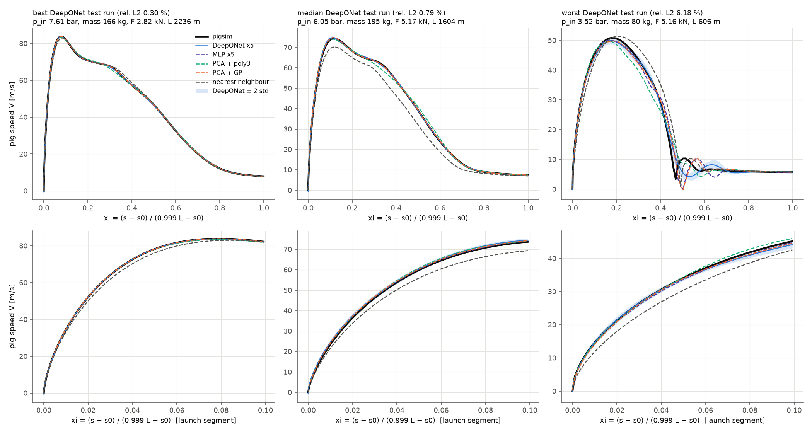
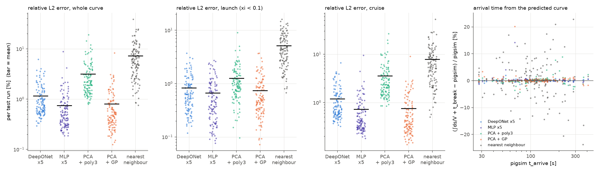
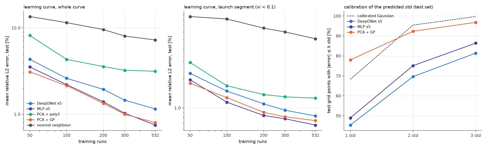
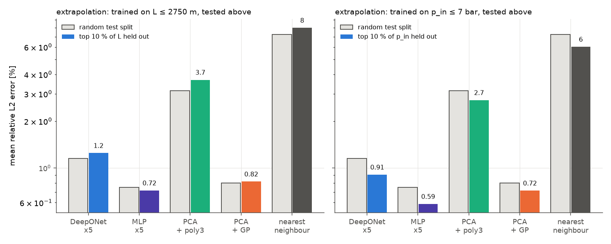

# 3단계 — 속도 곡선 전체 예측 (연산자 학습)

1–2단계는 입력 4개에서 숫자 2개(`t_arrive`, `v_max`)를 예측했다. 3단계는 **pig 속도 곡선 전체 V(ξ)** 를 예측한다. 입력 범위와 배관은 1단계와 같다(`surrogate/pipeline.py`). 결과는 있는 그대로 적었고, 신경망 연산자(DeepONet)는 가장 좋은 모델이 아니었다.

| 재현 명령 | 소요 |
|---|---|
| `python surrogate/stage3/generate_curves.py` → `curves.npz` (760회) | 파일럿 후 31분 (4 프로세스) |
| `python surrogate/stage3/run_stage3.py` → `metrics.json`, `figures/`, `models/deeponet.pt` | 11분 (4 프로세스) |
| `python surrogate/stage3/run_stage3.py --plots-only` → 그림만 다시 그리기 | 10초 |

## 1. 데이터

- **샘플 수**: 파일럿 8회로 실행당 10.6 s(4 프로세스 부하 포함)를 쟀고, 40분 × 85 %에 맞춰 **760회**로 정했다. LHS(seed 2024). 760회 모두 도착했고, 뒤로 움직인 실행은 0건이다.
- **격자**: ξ = (s − s₀)/(0.999 L − s₀), ξ_k = (k/127)², k = 0…127. ξ = 0이 출발점(s₀ = 2 m), ξ = 1이 도착점이다. 요청한 s/L과는 s₀/L(최대 0.4 %)만큼 다르다. 이렇게 해야 모든 L에서 ξ = 0이 출발점이 된다. 제곱 간격이라 128점 중 40점이 출발 구간 ξ < 0.1에 있다.
- **곡선 값**: 각 격자점을 pig가 **처음** 지나는 시점의 속도를 썼다(이번 데이터에서는 역주행이 없어 차이 없음).
- **분할**: 70 / 15 / 15 = 532 / 114 / 114 (`default_rng(0)`). 검증 세트는 신경망 조기 종료에만 쓴다.

**격자 자체의 손실 (참값 곡선으로 계산, 테스트 114건)**

| 항목 | 값 |
|---|---|
| 격자 최댓값 vs pigsim `v_max` | 평균 0.008 % |
| 참값 곡선 ∫ds/V + pigsim 출발 시각 vs pigsim `t_arrive` | 평균 0.17 % |
| 참값 곡선 ∫ds/V + 해석적 출발 시각 vs pigsim `t_arrive` | 평균 0.28 % |
| 해석적 출발 시각 − pigsim 출발 시각 | 평균 +0.14 s, 최대 0.70 s |

- ∫ds/V는 구간마다 `Δt = 2Δs/(V_k + V_{k+1})`로 계산했다(구간 안 가속도가 일정하면 정확). 출발점에서 V = 0이어도 발산하지 않는다.
- 곡선에는 pig가 출발하기 전 정지해 있는 시간이 없다. 입구 압력이 10 s 동안 올라가다 정지마찰을 넘는 시각을 해석적으로 `t_break = 10 s × (1.2 F/A)/(p_in − 1.5 bar)`로 더했다. 그래서 곡선 모델이 완벽해도 `t_arrive`에는 약 0.28 %의 바닥 오차가 있다.

## 2. 모델

| 모델 | 구조 |
|---|---|
| **DeepONet ×5** | branch: log 표준화 입력 4 → 64 → 64 → 32, trunk: [ξ, √ξ] → 64 → 64 → 32, 출력 V(ξ) = Σ_k branch_k · trunk_k + b. 128점은 한 번의 행렬곱 (n, 32) @ (32, 128)으로 계산한다. bootstrap + 다른 초기값 5개로 앙상블 |
| MLP ×5 | 입력 4 → 128 → 128 → 128 → 128개 값을 한 번에. 같은 방식의 앙상블 |
| PCA + 3차 다항 | 학습 곡선의 주성분 20개(분산 99.99 %), 주성분 점수를 log 입력의 3차 다항식으로 예측 |
| PCA + GP | 같은 주성분 20개, 점수마다 GP 하나(2단계와 같은 커널). 곡선 분산 = Σ_j φ_j(ξ)² σ_j² |
| 최근접 이웃 | log 표준화 입력 공간에서 가장 가까운 학습 실행의 곡선을 그대로 사용 |

신경망은 1단계와 같은 학습 루프다(Adam, `ReduceLROnPlateau`, 검증 MSE 조기 종료, 최대 3000 epoch). 출력은 V를 학습 데이터 표준편차로 나눈 값이고, 손실은 128점 MSE다(격자가 앞쪽에 촘촘해서 출발 구간이 자연히 더 큰 가중을 받는다). **DeepONet은 5개 중 4개가 최대 3000 epoch에서 멈췄다**(검증 손실이 아직 내려가는 중). epoch을 늘리면 조금 좋아질 수 있지만 이번에는 같은 조건으로 두었다.

## 3. 결과 (테스트 114건)

### 3.1 곡선 정확도

상대 L2 오차 = √(∫(V̂ − V)² dξ / ∫V² dξ), 실행마다 계산한 뒤 요약. 단위 %.

| 모델 | 전체 평균 | 중앙값 | 95 백분위 | 최대 | 출발 (ξ < 0.1) | 순항 (ξ ≥ 0.1) |
|---|---|---|---|---|---|---|
| DeepONet ×5 | 1.15 | 0.78 | 3.05 | 6.18 | 0.83 | 1.19 |
| **MLP ×5** | **0.75** | **0.47** | **1.94** | 8.78 | **0.67** | **0.72** |
| PCA + 3차 다항 | 3.15 | 2.18 | 8.81 | 19.1 | 1.26 | 3.58 |
| PCA + GP | 0.80 | 0.49 | 2.49 | 8.32 | 0.74 | 0.76 |
| 최근접 이웃 | 7.25 | 5.72 | 18.4 | 39.0 | 5.12 | 7.80 |

### 3.2 곡선에서 뽑은 값

| 모델 | `v_max` 오차 평균 / 최대 [%] | `v_max` 위치 오차 평균 / 중앙값 [m] | ∫ds/V로 구한 `t_arrive` 오차 평균 / 95 % / 최대 [%] |
|---|---|---|---|
| DeepONet ×5 | 0.46 / 2.35 | 7.2 / 4.0 | **0.25** / 0.79 / 1.99 |
| MLP ×5 | **0.31** / 1.58 | **4.4 / 0.0** | 0.38 / 0.89 / 14.2 |
| PCA + 3차 다항 | 0.97 / 4.85 | 13.4 / 8.6 | 0.79 / 3.26 / 8.85 |
| PCA + GP | 0.47 / 3.11 | 5.9 / 0.0 | 0.68 / 1.73 / 20.2 |
| 최근접 이웃 | 3.44 / 12.9 | 16.9 / 11.1 | 6.03 / 16.7 / 23.7 |

- **곡선 전체는 MLP ×5가 가장 정확했고, PCA + GP가 거의 같았다.** DeepONet은 그보다 1.5배 나쁘다. 이 문제에서는 출력 격자가 고정(128점)이라, DeepONet의 장점(임의의 ξ에서 평가)이 정확도로 이어지지 않았다.
- **`t_arrive`는 DeepONet이 가장 좋다(0.25 %).** 바닥 오차 0.28 %와 같은 수준이다. 곡선 전체 오차와 순위가 다른 이유는 ∫ds/V가 출발 직후 속도가 작은 몇 점에 민감하기 때문이다. MLP와 GP는 대부분 정확하지만 출발점 근처 V가 0에 가깝게 틀린 실행이 1건씩 있어, 최대 오차가 14 %, 20 %로 튄다.
- **3차 다항식은 여기서는 부족했다.** 스칼라 2개(2단계)에서는 신경망과 비슷했지만, 곡선은 주성분이 20개 필요하고 고차 주성분 점수를 3차식이 따라가지 못한다(순항 구간 3.6 %).
- 최근접 이웃은 학습점이 532개로는 4차원 공간을 촘촘히 덮지 못해 7 %다.
- 가장 어려운 곡선(그림 1 오른쪽)은 짧은 배관(606 m)에서 pig가 ξ ≈ 0.47에 거의 멈췄다가(약 3 m/s) 다시 출렁이는 경우다. 다섯 모델 모두 그 위치와 진동 위상을 놓쳤다.

### 3.3 불확실성 보정 (테스트 격자점 114 × 128개)

| 모델 | \|오차\| ≤ 1 std | ≤ 2 std | ≤ 3 std | 출발 구간 ≤ 2 std | 평균 std [m/s] |
|---|---|---|---|---|---|
| DeepONet ×5 | 45 % | 70 % | 81 % | 60 % | 0.20 |
| MLP ×5 | 49 % | 75 % | 86 % | 63 % | 0.16 |
| PCA + GP | 78 % | **92 %** | 97 % | **87 %** | 0.38 |
| (보정된 정규분포) | 68 % | 95 % | 99.7 % | | |

앙상블(DeepONet, MLP)은 1–2단계와 같이 **과신**한다(2σ 안에 70–75 %). PCA + GP는 2σ 92 %로 거의 보정되어 있다.

### 3.4 외삽 — 상위 10 %를 빼고 학습

| 모델 | L > 2750 m (76건) 곡선 / `t_arrive` 오차 [%] | p_in > 7.5 bar (76건) 곡선 / `t_arrive` 오차 [%] |
|---|---|---|
| DeepONet ×5 | 1.25 / 0.23 | 0.91 / 0.25 |
| MLP ×5 | **0.72** / **0.22** | **0.59** / 0.41 |
| PCA + 3차 다항 | 3.69 / 160 (중앙값 수준은 95 % 백분위 3.7) | 2.73 / 0.47 |
| PCA + GP | 0.82 / 0.72 | 0.72 / 0.76 |
| 최근접 이웃 | 7.98 / 6.05 | 6.02 / 6.50 |

외삽 구간 학습에는 나머지 실행의 85 %(581건)를 썼다. 무작위 분할(532건)보다 학습 데이터가 조금 많다.

- **예상과 달리 외삽 오차가 무작위 분할과 비슷하거나 더 작았다.** ξ로 정규화한 곡선 모양은 L이 길어져도 크게 변하지 않는다. p_in이 높으면 곡선이 더 매끄럽다. 그래서 상위 10 % 정도는 쉬운 외삽이었다. 2단계에서 본 영역 전환(출발 실패)은 이 범위에 없다.
- PCA + 3차 다항의 L 외삽 `t_arrive` 평균 160 %는 한 실행에서 출발 직후 속도를 0 근처로 예측해 ∫ds/V가 12,000 % 튄 결과다. 나머지 실행은 95 % 백분위 3.7 %다.
- PCA + GP의 2σ 비율은 외삽에서도 92–93 %를 유지했다. DeepONet은 74–81 %, MLP는 77–80 %다.

### 3.5 학습 곡선 (테스트 114건 고정, 곡선 전체 평균 오차 %)

| 학습 실행 수 | 50 | 100 | 200 | 300 | 532 |
|---|---|---|---|---|---|
| DeepONet ×5 | 4.32 | 2.61 | 1.94 | 1.45 | 1.15 |
| MLP ×5 | 3.53 | 2.20 | 1.39 | 1.03 | 0.75 |
| PCA + 3차 다항 | 8.16 | 4.32 | 3.57 | 3.23 | 3.15 |
| PCA + GP | **3.09** | **2.14** | **1.34** | **1.00** | 0.80 |
| 최근접 이웃 | 13.5 | 11.5 | 9.6 | 8.0 | 7.2 |

- 데이터가 적을 때(≤ 300)는 PCA + GP가 가장 좋고, 532개에서 MLP가 근소하게 앞선다. 신경망 두 개와 GP는 아직 수렴하지 않았다(데이터를 늘리면 더 좋아질 여지가 있다). 3차 다항식은 200개 이후 거의 평평하다(모델 표현력의 한계).
- 학습 데이터가 50개일 때 PCA + 3차 다항은 `t_arrive`가 5,500 %, DeepONet은 33 % 틀렸다. 둘 다 출발점 근처 V를 0 이하로 예측한 실행 때문이다. 곡선에서 시간을 적분해 쓰려면 V > 0 같은 물리 제약을 출력에 넣는 것이 다음 개선점이다.

### 3.6 비용

| 모델 | 학습 [s] (532건, 1 코어) | 예측 [ms / 실행] |
|---|---|---|
| DeepONet ×5 | 187 | 0.02 |
| MLP ×5 | 102 | 0.015 |
| PCA + 3차 다항 | 0.02 | 0.011 |
| PCA + GP | 270 | 0.49 |
| 최근접 이웃 | 0.002 | 0.014 |

pigsim 1회는 약 10 s다.

## 4. 그림 (`surrogate/stage3/figures/`)

`curves_examples.png` — DeepONet 기준 가장 좋은 / 중간 / 가장 나쁜 테스트 곡선과 다섯 모델의 예측. 아래 줄은 출발 구간(ξ < 0.1) 확대다. 파란 띠는 DeepONet ±2 std.

`errors_by_segment.png` — 실행별 상대 L2 오차(전체 / 출발 / 순항)와, 곡선으로 적분한 `t_arrive`의 오차.

`learning_and_calibration.png` — 학습 곡선(전체, 출발 구간)과 k std 안에 든 격자점 비율.

`extrapolation.png` — 무작위 분할(회색) vs 상위 10 % 제외 학습(색).

## 5. 정리와 남은 문제

- 곡선 전체는 **MLP ×5 ≈ PCA + GP > DeepONet > PCA + 3차 다항 > 최근접 이웃** 순서였다. 불확실성은 PCA + GP만 거의 보정되어 있다. DeepONet이 앞선 지표는 ∫ds/V로 구한 `t_arrive` 하나다.
- 128점 고정 격자에서는 DeepONet의 구조적 이점이 드러나지 않았다. 이 이점을 시험하려면 격자가 실행마다 다르거나, 학습 때 보지 않은 ξ에서 평가하는 문제가 필요하다.
- DeepONet은 5개 중 4개가 최대 epoch에서 멈춰, 완전히 수렴하지 않았다.
- 출발점 근처에서 V ≤ 0을 예측하면 ∫ds/V가 발산한다. 출력에 양수 제약(예: softplus)이나 √ξ 형태의 출발 거동을 넣는 것이 다음 후보다.
- 외삽 시험은 상위 10 %로 쉬운 편이었다. 영역 전환을 포함하는 외삽(2단계 9절)은 이 데이터에 없다.
